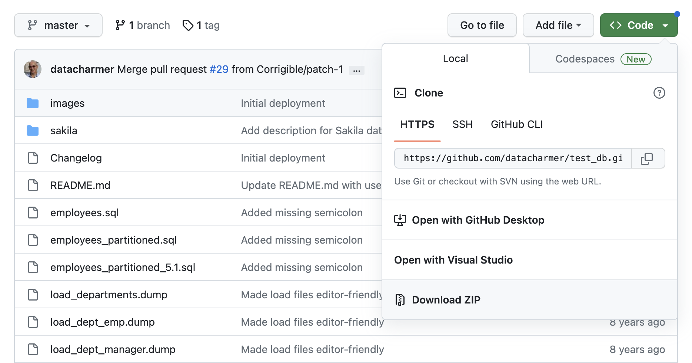

# 대용량 테스트 데이터 만들기

## 1. 대용량 테스트 데이터

혼자 공부할 때 대용량 데이터가 있으면 좋을 것 같아 찾게된 샘플 데이터를 소개합니다.  
MySQL 공식 문서에서도 소개하고 있는 샘플 데이터로 테스트 및 학습하기 참 좋은 샘플 같습니다.  
샘플 데이터 구조 및 데이터간의 연관관계는 다음과 같습니다.  


직원과 부서 등으로 구성된 샘플 데이터로 실무에서 사용하는 데이터 만큼은 아니겠지만,  
테스트 데이터로 조회와 Join등을 학습하기에도 좋은 데이터로 보입니다.  
이전 포스팅에서는 도커 컨테이너로 MySQL 구축하는 방법을 배워보았습니다.  
오늘은 이 샘플 데이터를 다운받아 도커 컨테이너에 Import 하는 방법까지 소개하려고 합니다.  
이후에는 인덱스 및 Join등에 대한 예제를 이 샘플 데이터를 기준으로 포스팅을 하려고 합니다.  

## 2. 샘플 데이터 Import 하기

### 2.1. MySQL 도커 이미지 생성

앞선 포스팅에서 MySQL 이미지를 생성하고, 컨테이너에 접속까지 해보았습니다.  
이과정은 이전 포스팅을 참조해주시면 감사드리겠습니다.  

### 2.2. 샘플 데이터 다운로드

샘플 데이터는 GitHub에서 쉽게 다운로드 가능합니다.  
[샘플 데이터 Github](https://github.com/datacharmer/test_db) 여기서 다운로드 해주세요!  
샘플 데이터를 다운로드합니다. download-zip 또는 git clone을 해줍니다.    


### 2.3. 샘플 데이터 Import 하기

샘플 데이터를 다운로드 받았으면, Import 하는 방법은 크게 두가지가 있습니다.  
첫번째는 컨테이너로 데이터 파일을 복사후 Dump 파일을 Import 하는 방법입니다.   
두번째는 MySQL Workbench, DBeaver 와 같은 Gui툴로 Import 하는 방법입니다.  
결국 두개의 방법이 크게 다르지 않지만, 두가지 모두 소개 하도록 하곘습니다.  

우선 첫번쨰 방법입니다.  
다운로드 받은 파일을 생성된 MySQL 컨테이너로 복사해줍니다.  
Download zip 으로 다운로드 받은 경우 zip 파일 해제후 복사해주도록 합니다.  
MySQL 컨테이너의 경우 이미지를 다운받았다면 unzip이 없기 때문입니다.  

```bash
docker cp test_db-master mysql:/root
```

컨테이너 내부에 파일 복사가 완료되었다면 다음과 같이 Import 해줍니다.  

```bash
mysql -u root -p < employees.sql