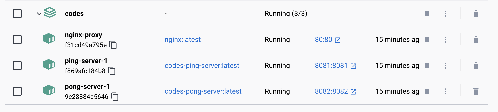
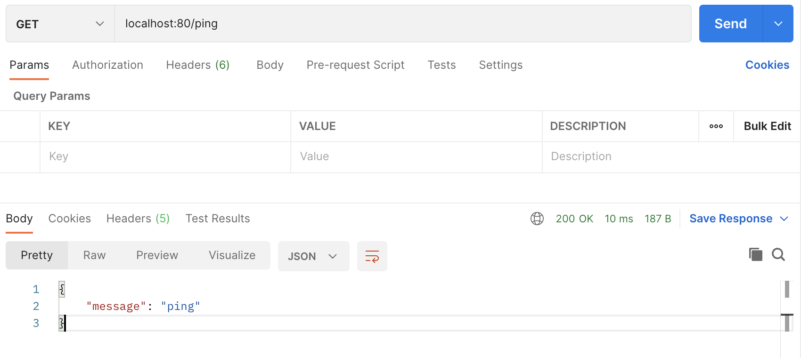
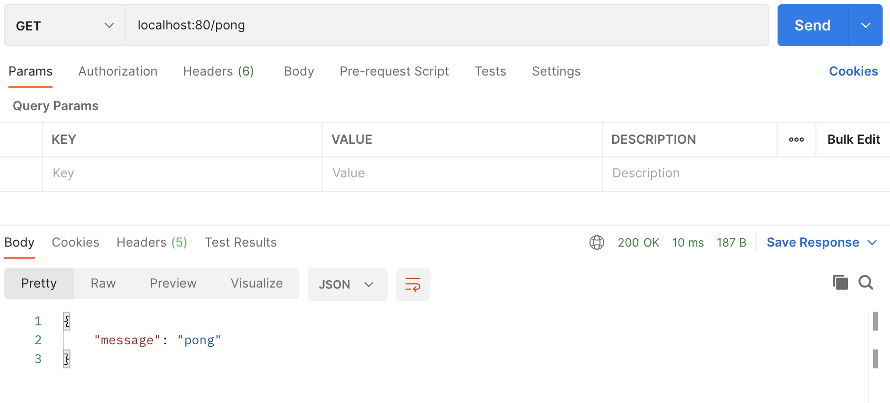

# Docker에서 Nginx 리버스 프록시 사용법


## 1. 리버스 프록시 란?

### 1.1. Nginx의 리버스 프록시 기능 사용해보기

### 1.2. 리버스 프록시 장점 및 사용하는 이유

## 2. Docker Nginx 컨테이너 생성

### 2.1. nginx.conf 파일 작성

```conf
worker_processes 1;
events {
	worker_connections 1024;
}

http {
	upstream ping-server {
		server 172.17.0.1:8081;

		# server $host주소:포트
		# 예시1 : server 127.0.0.1:8080 
		# 예시2 : server ec2_private_ip:custom_port
	}

	upstream pong-server {
		server 172.17.0.1:8082;
	}

	server {
		listen 80;
		# listen $요청받을포트

		location /ping {
			proxy_pass http://ping-server;
		}

		location /pong {
			proxy_pass http://pong-server;
		}
	}
}

```

## 3. Golang 서버 컨테이너 생성

gin을 이용해 8081 포트와 8082 포트를 사용하는 서버의 컨테이너를 생성한다.

```golang
package main

import "github.com/gin-gonic/gin"

func main() {
	r := gin.Default()
	
	r.GET("/hello", func(c *gin.Context) {
		c.JSON(200, gin.H{
			"message": "hello",
		})
	})

	r.Run(":8081")
}
```

서버의 포트와 url 를 절절하게 변경하여 8081, 8082 포트를 사용하는 서버 코드를 작성한다.  
8081 포트는 hello url을 사용하도록 하고,  
8082 포트는 world url을 사용하도록 설정한다.  

## 4. docker-compose.yaml 파일 작성

```yaml
version: '3'

services:
  nginx:
    image: nginx
    ports:
      - 80:80
    volumes:
      - ./nginx/nginx.conf:/etc/nginx/nginx.conf
    container_name: nginx-proxy
    depends_on:
      - ping-server
      - pong-server

  ping-server:
    build:
      context: ./ping-server
      dockerfile: ./Dockerfile
    ports:
      - "8081:8081"

  pong-server:
    build:
      context: ./pong-server
      dockerfile: ./Dockerfile
    ports:
      - "8082:8082"

```


## 5. docker-compose 실행하기

`docker-compose up -d`를 수행한 화면이다.



postman 으로 요청을 보내보면 응답을 받을수 있다.

8081 포트의 서버의 응답 `ping`



8082 포트의 서버의 응답 `pong`



## 6. 마무리
