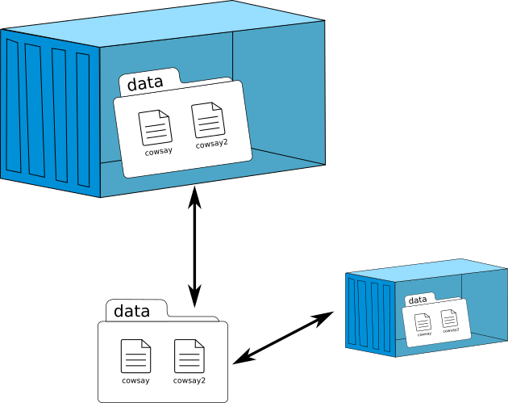
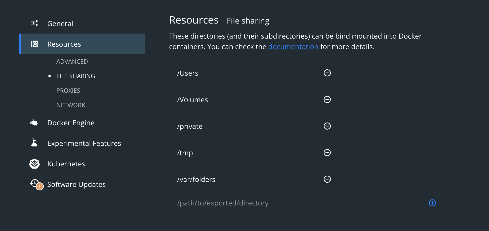
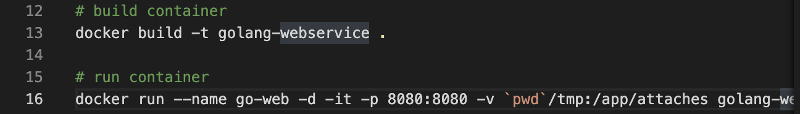

# 맥에서 도커(Docker) 볼륨 사용시 /var/lib/docker 디렉토리가 없을때

## 1. 도커 볼륨

### 1.1. 볼륨

쉽게 말해서 버츄얼 박스나 VMWare 에서 자주 사용하는 공유 폴더와 비슷한 기능이다.  
다만 차이점이 조금 있는데, 바로 컨테이너의 휘발성이다.  
컨테이너가 종료되면 컨테이너 내부에 저장된 데이터는 영원히 사라진다.  
실제 서비스를 개발/운영 하다보면 데이터를 어딘가에 저장 해야하는 경우가 발생한다.  
하지만 데이터 휘발성 때문에 컨테이너 내부에는 저장할 수 없다.  
이때 도커의 볼륨 기능을 사용해 생성된 데이터를 안전하게 저장할 수 있는 것이다.  

### 1.2. 맥에서 도커 볼륨 사용

예전에 도커를 맥에서 사용하려고 할때 겪었던 문제를 공유해보려고 한다.  
도커에서 볼륨을 사용하기 위해서 볼륨 설정을 하고 컨테이너를 실행해서 테스트를 하였다.  
테스트 코드 상으로는 볼륨에 데이터가 잘 생성되었고, 앱구동에는 별다른 문제가 없었다.  
그래서 실제로 파일이 존재하는지 확인 하기 위해서 해당 경로로 확인해보려는데,  
문제가있었다. 바로 `/var/lib/docker` 디렉토리가 없었기 때문이다.  

## 2. 맥os의 도커 구조

`/var/lib/docker` 디렉토리가 없는 이유는 매우 간단하다.  
맥에서는 도커 구동시에 리눅스와는 다르게 바로 도커가 실행되는 구조가 아니다.  
linux 가상 머신이 생성되고, 가상머신 안에서 도커가 구동되기 때문이다.  
그래서 아무리 `/var/lib/docker` 파일을 찾아봤자 없었던 것이다.  
`/var/lib/docker`에 접근 하려면 리눅스 가상머신에 접속한뒤에 접근해야한다.  

## 3. 도커의 볼륨

본 포스팅에서는 볼륨 사용법에 대헤서는 소개하지 않고 간단하게만 원리만 설명하겠다.  
도커에서 볼륨을 사용하는 방법은 크게 2가지가 있다.  
하나는 Host OS와 Docker가 공용으로 사용하는 디렉토리에 볼륨을 생성하는 것이고,  
다른 하나는 Host OS에 존재하는 디렉토리를 Docker 컨테이너와 직접 연결하는 방식이다.  

내가 사용한 방법은 첫번째 방법이고, 실제로 `/var/lib/docker`에 데이터가 있을거라고 생각했는데, 없었다.  
실제 데이터는 맥에서 도커 구동을 위해 생성된 리눅스 가상머신에 잘 저장되었을 것이다.  

## 4. 맥에서 도커 볼륨 사용법

### 4.1. 결론

우선 맥에서는 첫번째 방법을 사용 할수가 없다.  
첫번째 방법을 사용하려면 맥에서 리눅스 가상머신과의 데이터 공유가 이뤄져야한다.  
게다가 실제로는 `/var/lib/docker`에 컨테이너 아이디 디렉토리가 생성된다.  
그리고 볼륨 사용시에는 그안에 데이터가 안전하게 저장 된다.  

문제는 컨테이너가 한 두개일 경우에는 쉽게 컨테이너 아이디 식별이 가능하지만,  
컨테이너가 다수가 구동중이라면 아이디를 식별하기도 어려울 뿐더러,
여러개의 컨테이너에서 동일한 파일에 접근해야하는 경우 골치가 아파진다.  

그래서 주로 사용하는 방법은 두번째 방법인  
특정 디렉토리를 바로 도커의 컨테이너와 직접 연결하는 방식이다.  
이렇게 한다면 동일한 디렉토리를 여러개의 컨테이너에서 접근할 수 있다.  

### 4.2. 맥에서 도커 사용법

우선 도커 데스크탑에서 설정에 간다.  
`Resource` 설정에서 `File Sharing` 옵션에 사용하고자하는 디렉토리 경로를 추가해준다.  

Dockerfile에서 사용법은 다음과 같다.  
`-v` 옵션을 사용하고 `위에 설정한 경로:컨테이너 내부 경로`를 이용해주면 된다.  
테스트 해보면 설정한 경로에 데이터가 안전하게 저장된다.  
