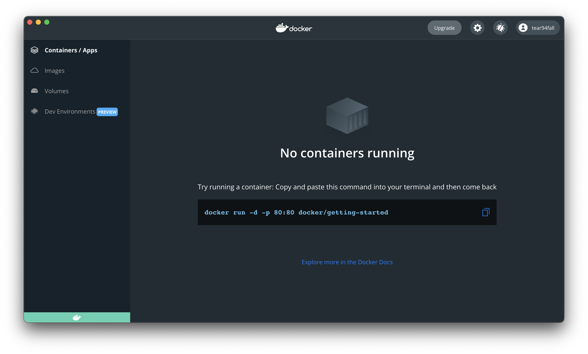

# Docker 설치하기

## 1. 도커란 무엇인가?

도커는 컨테이너 기반의 가상화 플랫폼 입니다.  
그럼 가상화 기술은 무엇이고? 컨테이너는 무엇일까요?
이 두개를 알아보기 전에 가상화 기술이 생겨났는지를 한번 살펴볼까요?

### 1.1. 도커 이전의 환경은?
클라우드 환경이 나오기전에 서비스들은 실물 서버 장비(온프레미스) 환경에서 구동되었습니다.  
한개의 장비에 데이터 베이스, 웹서버 등을 설치하여 환경을 구성했습니다.
 

그런데 만일 서비스의 현재 버전이 1.0.1 버전인데 이전 버전인 1.0.0 버전 환경에서 테스트를 하고 싶을때 어떻게 해야할까요?  
데이터 베이스와 웹서버등을 다운그레이드 해야합니다. 그래서 열심히 다운그레이드를 헀습니다.  
중요한 테스트고 오래도록 진행된다고 합시다. 갑자기 1.0.1 버전의 버그를 수정하고 싶을때 어떻게 해야할까요?  
 

네! 다시 업그레이드를 하거나, 다른 온프레미스 장비에 1.0.1 버전을 설치하는 방법이 있습니다.  
다른 여유 장비가 있다면 다행이지만, 만일 여유 장비가 없다면 어떻게 해야할까요?  
또 이두개의 버전을 동시에 비교하면서 테스트를 해보고 싶다면 어떻게 해야할까요?

### 1.2. 소프트웨어 아키텍쳐의 발전

한가지 더 중요한 고민이 필요한 주제를 얘기해보려고 합니다.  
최근의 소프트웨어들은 다수의 사용자의 요구를 만족하기 위해 많은 기능을 지원해야 했습니다.  
 

그렇다 보니 소프트웨어의 복잡도는 증가했고, 크기는 매우커졌습니다.  
이전처럼 하나의 서버로 사용자의 모든 요구 조건을 충족시킬수가 없어졌습니다.  
사용자가 엄청나게 들어나면서 로그인 기능을 제공하는것만으로도 부하가 생길수 있기 때문이죠. 
 

또한 기능이 많아지면서 소수의 개발자가 모든 부분을 알고 개발을 할수가 없어졌습니다.  
다수의 개발자가 각자의 역할을 정하고 협업을 하게되었죠.  
이렇게 하다보니 크게 상관이 없는 부분을 잘게 나누고, 연관성이 있는 부분은 묶을수 있게 되었습니다.  
이렇게 하다보니 하나의 기능이 작동하지 않는 장애가 발생하더라도 다른 부분은 정상적으로 작동할수 있어졌습니다.  
주문 부분에서 장애가 발생해서 물건을 주문하지는 못하더라도, 내가 결제했던 내역은 확인이 가능하도록 하게하는 것처럼 말입니다.

### 1.3. 도커와 마이크로 서비스 아키텍쳐

도커는 매우 긴밀하게 연관된 위의 두가지 문제에서를 해결해가는 과정에서 발생되었습니다.  
어플리케이션 구동환경을 각각 독립적인 공간으로 분리하여 서로 영향받지 않으면서 (가상화)  
동시에 구동 환경 자체를 매우 경량화하여 필요한 부분만 가지고 구동을 한다 (컨테이너)  
 

첫번째 질문에서 우리는 가상화 개념에 대해 생각 해볼 수 있었습니다.  
두번째 질문에서는 마이크로서비스 아키텍쳐의 등장 배경에 대해 생각 해볼 수 있었습니다.  
앞서 말했듯 두개의 문제는 바로 매우 밀접한 관계를 갖고있습니다.  
 

바로 마이크로서비스 아키텍쳐를 가능하게 한 것이 바로 가상화 기술을 사용한 도커의 등장입니다.  
도커는 이런한 가상화 기술을 구현한 구현체이기 때문입니다.  

## 2. 쿠버네티스 (k8s)

이제 도커를 통해 어플리케이션 구동 환경을 구분하고, 마이크로 서비스 아키텍쳐를 통해 운영환경을 구축 하였습니다.  
그런데 문제가 발생했습니다.  
서비스를 위해 다수의 컨테이너를 구동하였는데, 이 컨테이너의 수가 엄청나게 증가한 것 입니다.  
그래서 우리는 이 다수의 컨테이너를 관리하는 툴이 필요함을 느꼈습니다.  
앞선 개념 설명부분에서 말안한게 있는데 실제 서비스 운영에는 배포 부터 관리까지 수많은 고려 사항이 있습니다.    
 

그래서 쿠버네티스가 등장하게 되었습니다.  
쉽게 말해 쿠버네티스는 도커의 컨테이너를 관리하는 툴이라고 생각하면 됩니다.  
우리는 이제 컨테이너와 이를 관리하는 쿠버네티스에 대해 알게되었습니다.  
그럼 이제 설치를 하러 가볼까요?

## 3. 도커 설치 하기

`https://www.docker.com/` 도커 홈페이지에 가서 설치 파일을 다운로드 해줍니다.

도커 데스크톱을 설치 해줍니다.  
인텔 맥/arm 맥 환경에 맞게 설치 해줍니다.

dmg 파일을 실행해줍니다.

도커 파일을 어플리케이션 파일로 옮겨줍니다.

설치되는 동안 기다려 줍니다.

설치가 완료되고 실행을 해주면 우선적으로 권한을 허용해달라고 합니다.
권한을 허용해줍니다.

조금 지나면 실행되면서 상태표시줄에 도커 아이콘이 뜹니다.

동의 하라는 화면이 나옵니다. 동의를 눌러줍니다.  
이후나오는 화면은 그냥 진행해줍니다.

도커 대시보드가 뜨면서 도커 엔진이 시작중이라고 표시됩니다.  
우측하단에 주황색으로 도커의 상태를 표시합니다.

완료가 되면 우측하단의 상태표시 아이콘이 초록색으로 바뀝니다.  
아직은 컨테이너가 없으므로 아무것도 표시되는게 없습니다.  
도커 설치가 완료되었습니다.

## 4. 쿠버네티스(k8s) 설치하기

도커 대시보드 상단에 톱니바퀴를 클릭하면 쿠버네티스 관련 메뉴가 있습니다.  
쿠버네티스를 설치하는 과정을 설명하고 있으니, 설치하고 싶으시면 계속 따라옵니다.  
두개를 모두 체크하고 apply 버튼을 눌러줍니다.

install을 재차 묻는데 install 버튼을 눌러줍니다.

쿠버네티스가 설치중입니다. 역시 우측 하단 아이콘에 주황색으로 상태를 보여줍니다.

설치가 완료되면 우측 하단에 쿠버네티스 아이콘이 초록색으로 변경됩니다. 설치가 완료되었습니다.