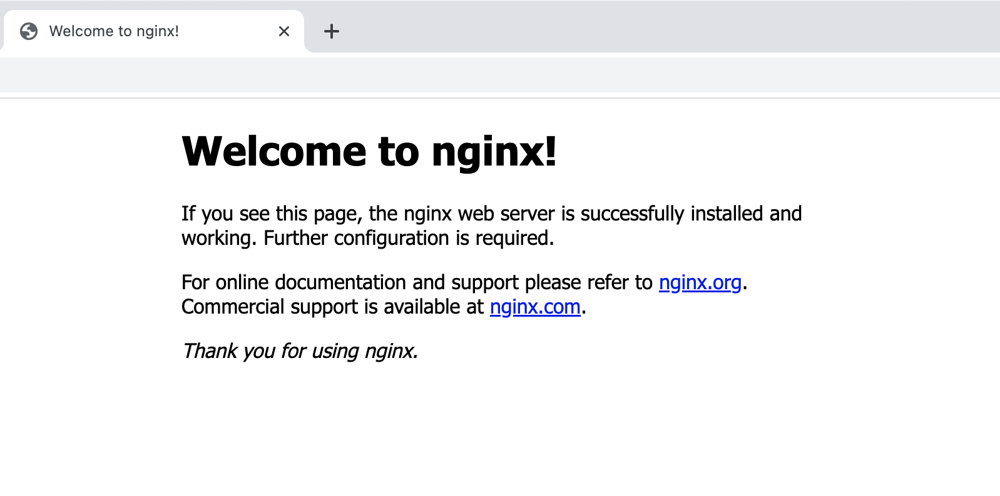

# 도커 컴포즈 사용법 (Docker Compose)


## 1. 도커 컴포즈란? (docker-compose)

도커 컴포즈가 무엇인지 설명하기에 앞서, 왜 도커 컴포즈를 사용하는지 알아보도록 하겠습니다.  

도커 환경에서 개발을 하다보면 컨테이너를 추가하거나 삭제 또는 재시작을 자주, 많이 하게 됩니다.  
한개 혹은 두개 정도의 컨테이너를 사용하는 경우 쉽게 컨테이너를 추가하거나 삭제 할 수 있습니다.  
하지만 서비스의 규모가 커지고 수없이 많은 컨테이너를 사용하게 된다면 어떻게 해야될까요?  

간단히 생각해보면 자동화 스크립트 등을 통해 컨테이너를 다루는 방법을 생각해볼수 있습니다.  
하지만 설정이 바뀐다면 어떻게 될까요? 또 통일된 인터페이스가 아니라 혼동을 줄수있다면 어떻게 될까요?  

예를 들어보겠습니다. 다음은 nginx를 실행하는 명령어입니다.  

```
docker run -d --name nginx -p 80:80 nginx:latest
```

매우 간단합니다. 최신 nginx 이미지로 nginx라는 이름의 컨테이너를 80 포트를 통해 실행하는 명령어입니다.  
하지만 슬프게도 실제 서비스를 운영하는 환경에서는 이렇게 간단하지만은 않을것입니다.  
여기에 추가로 볼륨 옵션을 사용하고 이런저런 옵션을 추가 하면 명령어의 길이가 수없이 길어질것 입니다.  

이것이 끝이 아닙니다! 옵션의 순서를 바꾸는 경우도 생각해 볼수 있습니다.  
A개발자는 옵션을 1-2-3과 같은 순서로 사용을 하고 있습니다.  
그런데 신규 입사자인 B개발자는 옵션을 3-1-2 와 같은 순서로 사용 하게된다면 어떻게 될까요?  
만일 새로운 C개발자가 이 팀에 합류하게 된다면 엄청난 혼란을 가지게 될것입니다.  
그럼 이러한 `다양한 옵션을 정해진 틀에 맞춰 만들고 틀을 그대로 찍어내듯 컨테이너를 다루는 방법`은 없을까요?  

네 바로 이러한 고민들로 인해 도커 컴포즈가 만들어 지게 되었습니다.  
도커를 사용하기 위해 우리는 Dockerfile을 만들었습니다.  
도커 컴포즈는 이러한 여러개의 Dockerfile을 다루기 위해 docker-compose.yml 파일을 이용하게 됩니다.  

그럼 이제 도커 컴포즈에 대한 이야기는 끝이 난것같습니다.  
이제 직접 예제를 통해 도커 컴포즈를 사용해보도록 하겠습니다.  

## 2. 도커 컴포즈 파일 예제

예제는 다음 포스팅인 `nginx 리버스 프록시` 를 하는데 좀더 쉽게 접근할수 있도록 nginx로 정하였습니다.  
예제는 docker-compose로 nginx 컨테이너를 생성하도록 하겠습니다.  

구성할 예제의 디렉토리 구조는 다음과 같습니다.  

```bash
$ tree
.
├── docker-compose.yml
└── nginx
    ├── Dockerfile
    └── nginx.conf

2 directories, 3 files
```

우선 nginx 디렉토리를 만들어줍니다.  
하위에 `Dockerfile`과 `nginx.conf` 파일을 생성 해야할 차례 입니다.  

위의 두개 파일은 깃허브 레포지토리의 파일을 사용해주시면 됩니다.  
[도커 컴포즈 nginx 예제 파일](https://github.com/tear94fall/blog_code/tree/master/docker/%EB%8F%84%EC%BB%A4%20%EC%BB%B4%ED%8F%AC%EC%A6%88%20%EC%82%AC%EC%9A%A9%EB%B2%95%20%EC%A0%95%EB%A6%AC) 에 `codes` 디렉토리를 참고 해주시면 감사드리곘습니다.  
두개 파일이 모두 다운로드가 완료되었다면,  

마지막으로 `docker-compose.yml` 파일을 생성하고 다음과 같은 내용을 입력하여 줍니다.  

```yml
version: '3.7'

services:
  nginx:
    build:
      context: ./nginx
    ports:
      - "8080:80"
    volumes:
      - ./nginx/nginx.conf:/etc/nginx/nginx.conf
```

하나씩 천천히 살펴보도록 하겠습니다.  
제일 첫줄에는 `vesion`을 적어주도록 합니다. 버전별로 지원하는 옵션이 다르니 유의 하시기 바랍니다.  

그다음에는 `service`를 적어줍니다. 이 항목 아래부터는 사용할 컨테이너들의 정보를 정의 하게됩니다.  
`service`아래에 nginx는 실행할 컨테이너의 이름입니다.  

다음은 매우 중요한 `build`입니다. 대신해서 `image`를 사용할수도 있습니다.  
`context`는 `.` 와 같은 현재 경로나 직접 작성한 Dockerfile의 경로를 통해 컨테이너를 실행해줍니다.  
`context` 빌드 항목 하위에 작성하여 줍니다.  
이름과 동일한 기능을 하는 `image`는 이미지를 통해 컨테이너를 실행하는 것입니다.  
만일 image를 사용하는 경우에는 다음과 같이 `image: nginx`를 작성해주면 됩니다.  

예제에서 image가 아닌 context를 사용해서 예제를 진행하는 이유는 다음과 같습니다.  
이번 예제에서는 nginx하나의 컨테이너를 생성하지만, 실제 개발시에는 여러개의 컨테이너를 생성하게 됩니다.  
하지만 하나의 경로에 Dockerfile 이라는 같은 이름의 파일이 여러개 존재할수가 없습니다.  
따라서 별도 경로를 만들고, 거기에 Dockerfile를 작성하여 docker-compose를 실행 하도록 하겠습니다.  

그럼 어떤 경우에 image를 사용하는지도 알아야 하겠죠?  
image를 사용하는 경우는 DB나 MessageQueue와 같은 3rd party 프로그램을 사용하는 경우에 주로 사용합니다.  
그럼 build는 언제 사용하느냐 하시면 개발하는 서버 혹은 소프트웨어를 컨테이너로 생성하는 경우에 주로 사용합니다.  
물론 도커 이미지를 생성하여 도커 허브에 이미지를 업로드 하여 사용하는 경우도 있을수 있습니다만 이는 논외로 합니다.  

다음은 대망의 `ports` 입니다. 우리가 보통 백엔드 서버를 개발하고 실행하면 적어도 하나의 포트를 점유하게 됩니다.  
이 옵션은 컨테이너가 사용할 포트를 적어주게 됩니다. 이 옵션은 `docker run` 명령어의 `-p` 옵션에 해당됩니다.  
`"8080:80"` 앞의 8080은 호스트에서 실제로 사용되는 포트이며, 80은 컨테이너 내부에서 사용하는 포트입니다.  
nginx에 접속을 하려면 80포트로 접속하는 경우 `404 Not found`를 보게 됩니다.  
80은 컨테이너 내부에서 사용하는 포트이기 떄문입니다. 8080으로 접속해야 Welcom nginx 페이지를 볼수있습니다.  

마지막은 volume 옵션입니다. `docker run` 명령어의 `-v` 옵션에 해당되는 항목입니다.  
`./nginx/nginx.conf:/etc/nginx/nginx.conf` 을 통해 작성한 nginx.conf 파일을 사용합니다.  
사용방법은 [호스트의 경로:컨테이너의 경로] 입니다.  

nginx 예제를 따라해보면서 혹시 느낀점이 있으신가요?  
맞습니다. 바로 docker의 명령어를 규격화 하여 파일로 저장하는 점입니다.  

`ports`, `volumes` 옵션은 바로 `docker run` 명령어의 옵션을 명시해준 것입니다.  
이외에도 다양한 옵션들이 존재하며, docker-compose 문법을 통해 사용할 수 있습니다.  
예를들어 `command` 옵션을 통해 특정 명령어를 실행할수도 있고,  
`environment` 옵션을 통해 환경 변수를 설정하는것도 가능합니다.  
또한 `container_name` 옵션을 통해 컨테이너 이름을 설정할 수도 있습니다.  

기타 다른 명령어들은 다음문서에서 확인 가능합니다. [도커 컴포즈 파일 공식 문서](https://docs.docker.com/compose/compose-file/)  

## 3. 도커 컴포즈를 이용한 컨테이너 생성 및 실행

docker-compose.yml 파일도 작성하였으니 실제 구동을 해볼 차례 입니다.  
`docker-compose up -d` 명령어를 통해 구동시켜줍니다.  
up 명령어는 컨테이너를 생성/시작 해주는 명령어 이며, `-d`옵션은 백그라운드에서 실행하는 옵션입니다.  
참고로 입력하는 명령어들은 `docker-compose.yml` 파일이 위치한 경로에서 수행하도록 합니다.  

앞서 배운 도커 명령어를 사용하여, 정상적으로 구동되었는지 확인합니다.  
```bash
$ docker ps
CONTAINER ID   IMAGE         COMMAND                  CREATED       STATUS       PORTS                  NAMES
6499ab0fbf27   codes-nginx   "/docker-entrypoint.…"   2 hours ago   Up 2 hours   0.0.0.0:8080->80/tcp   codes-nginx-1
```

정상적으로 구동이 되었습니다.  
그럼 한번 웹브라우저를 통해 nginx에 접속해보도록 하겠습니다.  
`http://localhost:8080` 으로 접속합니다.  
  
Welcom nginx! 정상적으로 접속이 되었습니다.  

그럼 혹시모르니 컨테이너 포트로 설정한 80 포트로 접속을 해볼까요?  
`http://localhost:80` 으로 접속합니다.  
  
네, 컨테이너 내부에서 사용되는 포트이기 때문에 접속이 되지 않습니다.  

그럼 컨테이너 내부에 접속해서 확인을 해볼까요?  
앞서 배운 명령어를 통해 nginx 컨테이너 내부로 접속해줍니다.  
```bash
$ docker exec -it codes-nginx-1 bash
root@6499ab0fbf27:/# 
```
네 접속이 완료되었습니다.  
컨테이너 내부에서 사용하는 명령어는 80 포트입니다.  
컨테이너는 gui가 없이 때문에 `curl` 명령어를 통해 요청을 보내보도록 하겠습니다.  

```bash
root@6499ab0fbf27:/# curl localhost:80
<!DOCTYPE html>
<html>
<head>
<title>Welcome to nginx!</title>
...
```
네, 정상적으로 `Welcom nginx` 응답을 받았습니다.   

컨테이너를 생성하고 테스트를 완료 하였다면, 사용하지 않는 경우 중지하는 명령어도 알아봐야겠죠?  
컨테이너를 중지하는 명령어는 `docker-compose stop` 입니다. 바로 수행해도록 하겠습니다.
```bash
$ docker-compose stop
[+] Running 1/1
 ⠿ Container codes-nginx-1  Stopped                                        0.2s
```
정상적으로 중지되었는지 확인해볼까요?
```bash
$ docker ps
CONTAINER ID   IMAGE     COMMAND   CREATED   STATUS    PORTS     NAMES
```
정상적으로 중지되었습니다.  

그럼 이제 더이상 컨테이너를 사용할 일이 없다면, 삭제 해야할것입니다.  
삭제 명령어는 `docker-compose rm` 입니다. 
```bash
$ docker-compose rm
? Going to remove codes-nginx-1 Yes
[+] Running 1/0
 ⠿ Container codes-nginx-1  Removed    
```
명령어 입력시 정말 삭제할것인지 입력을 하게됩니다. `y`를 눌러 삭제를 진행합니다.  
추가적으로 현재 예제는 하나의 컨테이너만 생성/삭제 합니다.  
만일 도커 컴포즈 파일에 다수의 컨테이너를 작성한 경우 모두 일괄적으로 삭제 하게됩니다.  

## 4. 도커 컴포즈 명령어 더 알아보기

도커 컴포즈는 컨테이너의 생성/시작/중지/삭제 이외에도 다양한 옵션을 제공하고 있습니다.  
이외의 docker-compose 명령어는 하위의 문서에서 확인할수 있습니다.  
[도커 컴포즈 명령어 공식 문서](https://docs.docker.com/compose/reference/)

## 5. 마무리

이번 포스팅에서는 도커 컴포즈 파일을 작성해았습니다.  
그리고 도커 컴포즈를 통해 nginx 컨테이너를 생성/시작/중지/삭제를 해보았습니다.  
다음 시간에는 nginx를 컨테이너를 이용해서 리버스 프록시에 대해 알아보도록 하겠습니다.  
감사합니다.  