# Go 설치하고 개발 환경 구축하기

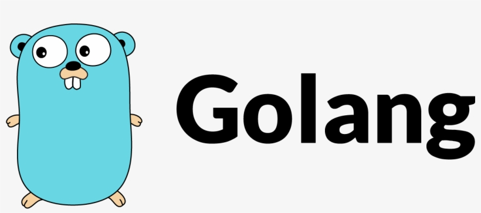

이번 포스팅에서는 go를 설치하고  
vscode를 통해 개발 환경을 구축한뒤에  
gin 프레임워크를 통해 간단한 웹서버를 구동시켜보겠습니다.  

## 1. 설치 하기

포스팅에서는 맥에서 Go를 설치하는 방법을 소개하려고 합니다.  
윈도우나 리눅스 환경에서도 크게 다르지 않습니다.  
윈도우에서는 다음과 같이 설치파일 다운로드 후 설치를 진행하면 됩니다.  
리눅스는 베포판의 패키지 매니저를 통해 설치합니다.   

`https://go.dev/`
Go 공식 사이트에서 설치파일을 다운로드 합니다.   
다운로드가 완료되면 실행하여 설치 해줍니다.  
크게 어려울것이 없고 순서대로 버튼만 잘 클릭하면 됩니다.  

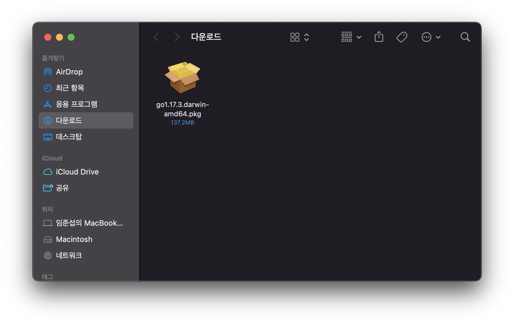

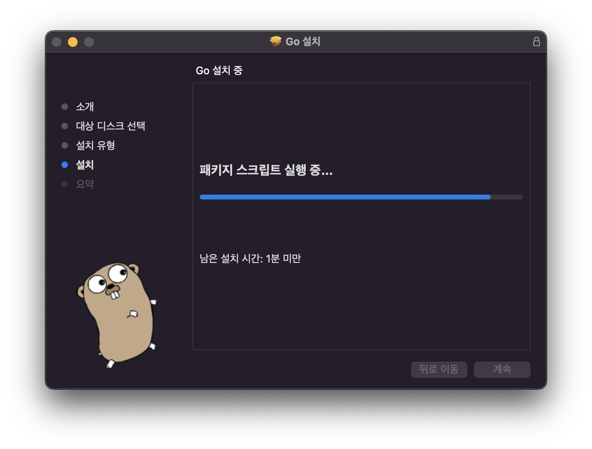
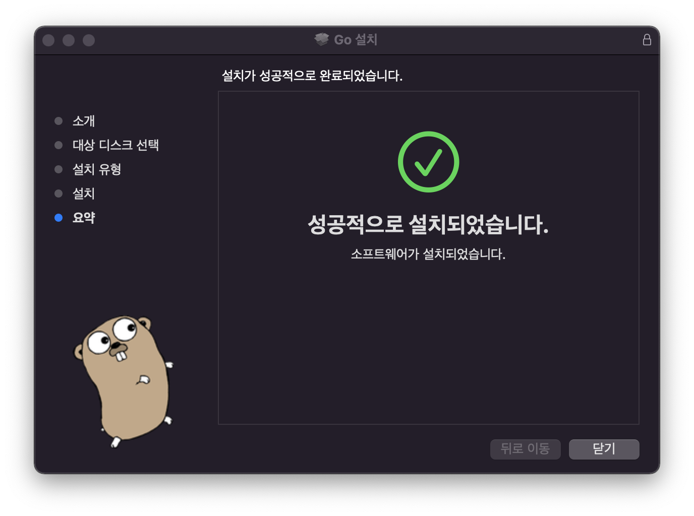

### 1-2. Go 설치하기
### 1-3. cmd로 Go 설치하기

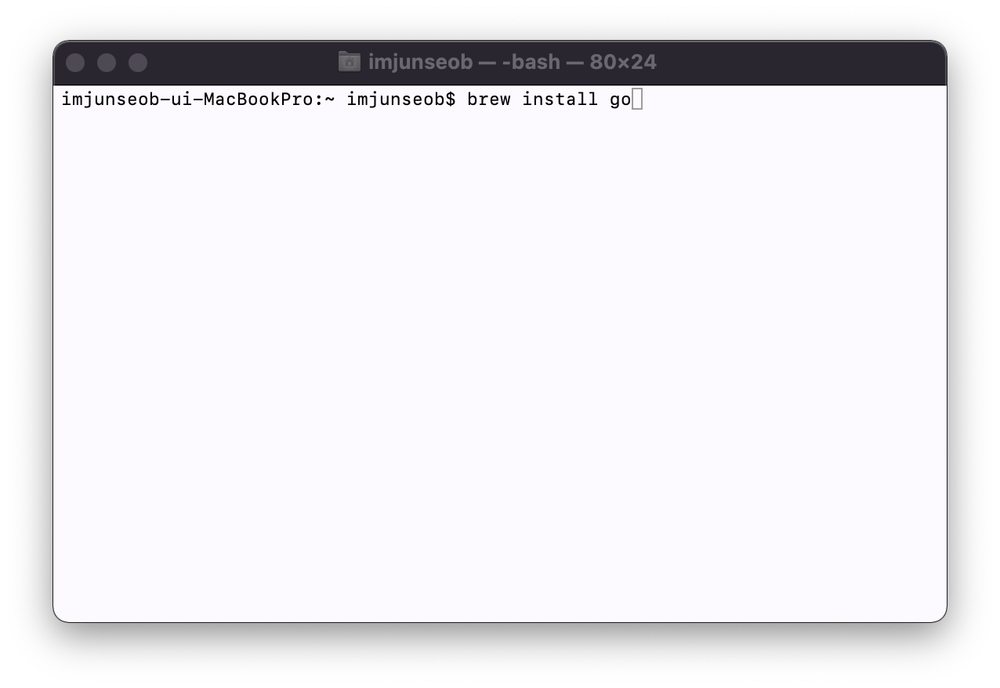
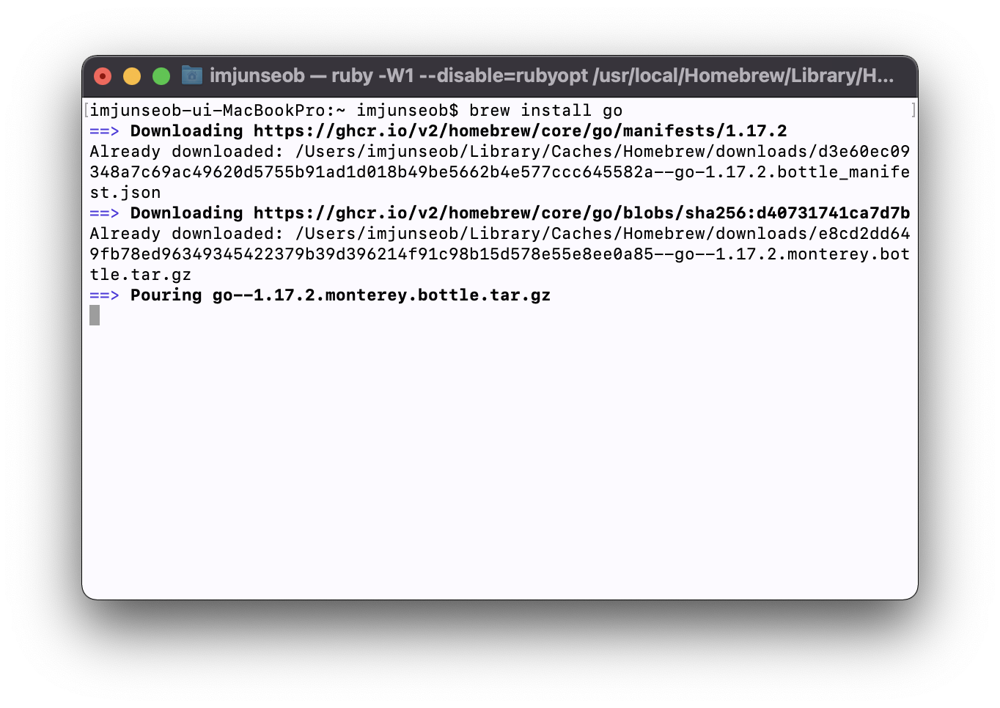

리눅스 설치방법  
우분투의 경우는 `apt-get install go` 로 설치하고   
Cent OS의 경우는 `yum install go` 으로 설치합니다.  
를 통해 다운로드 및 설치를 진행합니다.  

### 1-4. 버전확인

설치가 완료되었다면, 정상적으로 설치 되어있는지 확인 합니다.  

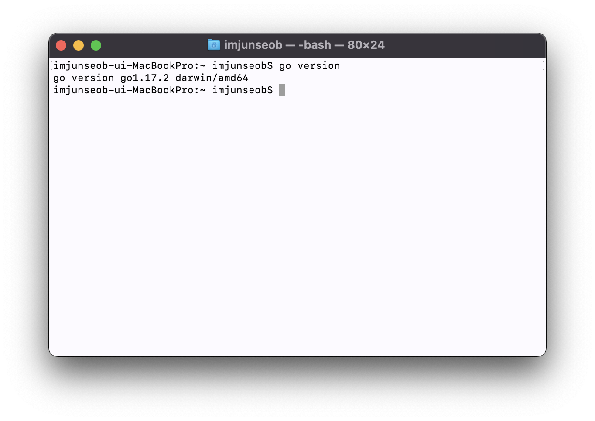

## 2. 개발 환경 구축

ide는 go-land와 vscode를 많이 사용합니다.      
go-land의 경우 유료 이기 때문에, 무료로 사용할 수 있는 vscode를 설치하도록 하겠습니다.  
vscode 설치의 경우 어렵지 않기 때문에 생략하도록 하겠습니다.  

go 관련 extension으로 구글에서 만든 go를 설치해줍니다.  

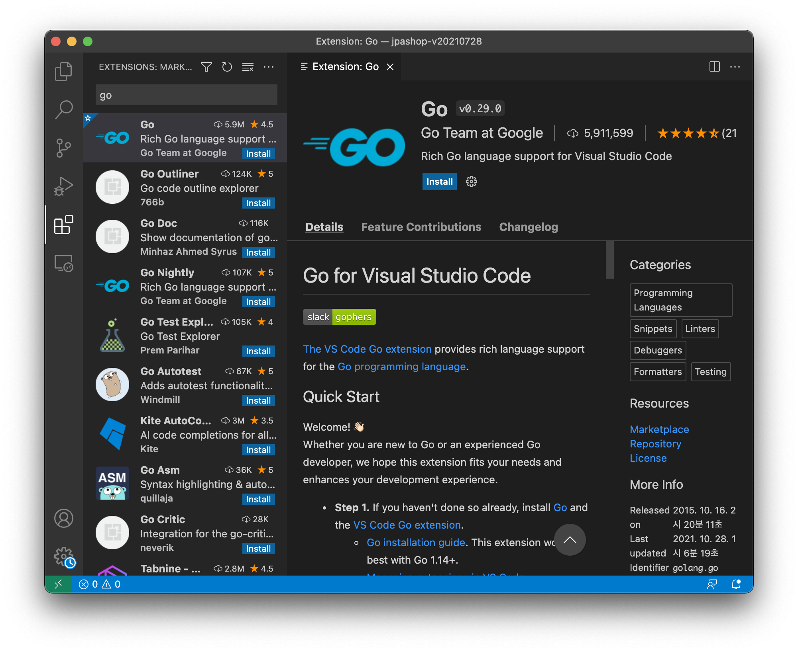  

extension을 설치하면 문법 관련 오류나 formatting과 같은 부분을 자동으로 해주기 때문에 매우 편리합니다.  

## 3.프로젝트 생성

go 프로젝트 생성을 위해 디렉토리를 하나 만들어줍니다.   

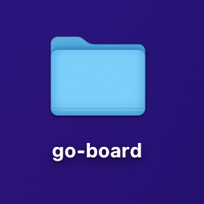  

그리고 파일을 하나 만들어 줍니다. (main.go)  

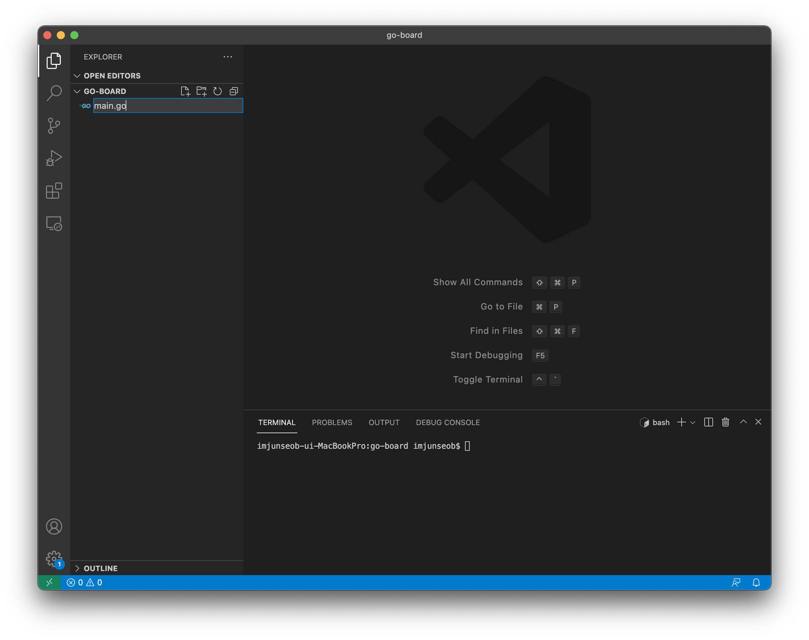  

```golang
package main

import fmt

func main(){
    fmt.Println("Hello world")

    return
}
```

그리고 간단한 예제 코드를 입력해줍니다.  

이제 실행을 해야하는데 실행 방법은 다음과 같습니다.  

go run main.go 처음 실행하면 오류가 발생하면서 실행되지 않을 것입니다.  

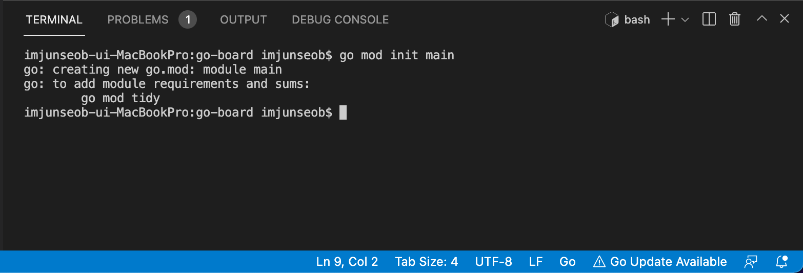

그럴경우 `go mod init <패키지 이름>`을 실행해줍니다.  
그러면 `go mod tidy` 를 입력하라고 합니다. 입력해줍니다.  

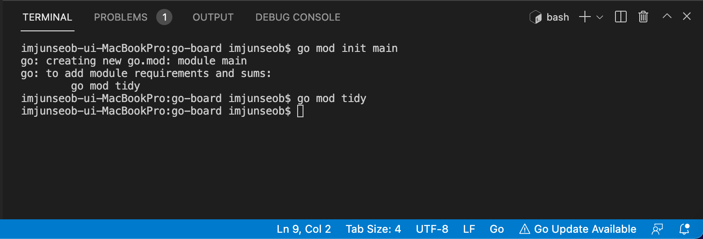

두 명령을 실행하고 나면 파일이 생성될 것입니다.  
현재는 fmt 패키지만을 사용해서 go.mod만 생성되는데  
패키지를 설치하고 사용하면 `go.sum`파일도 같이 생성됩니다.  
이는 아래에 패키지 설치에서 확인 할수 있습니다.  

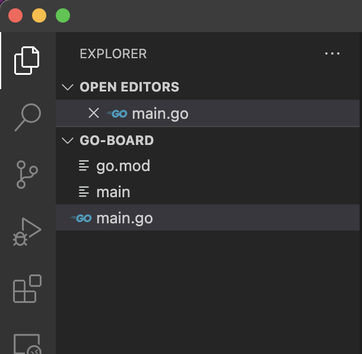  

입력 한뒤 실행 해줍니다.  

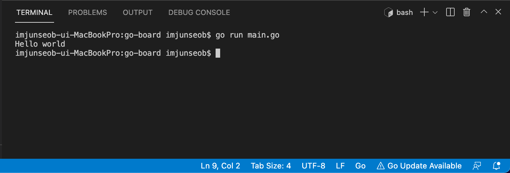

`Hello world`가 보이면 정상적으로 실행된것 입니다.  
Go는 실행 뿐만 아니라, 실행파일로 컴파일 할수 도 있습니다.  

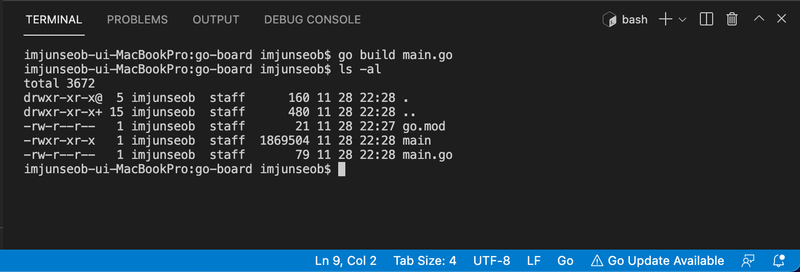

`go build main.go`를 실행한 후 생성되는 파일을 봅니다.  
`main`이라는 실행파일이 생성되었습니다.  

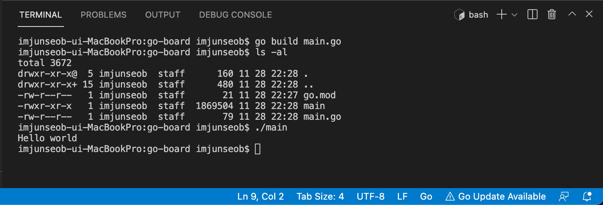

이것을 실행하면 방금전에 `go run main.go`와 같은 실핼결과를 얻을 수 있습니다.  

## 4. 패키지 사용하기

패키지를 사용하는 간단한 코드를 입력해줍니다.  

```golang
package main

import "github.com/gin-gonic/gin"

func main() {
	r := gin.Default()
	
	r.GET("/hello", func(c *gin.Context) {
		c.JSON(200, gin.H{
			"message": "pong",
		})
	})

	r.Run(":8080")
}
```

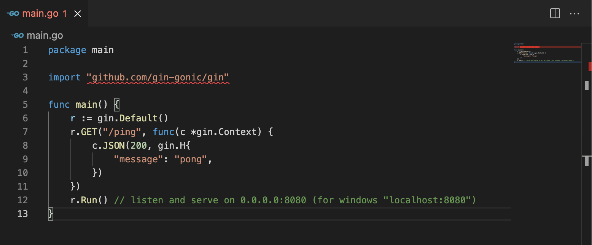  
코드를 입력해주면 패키지를 입력하는 부분에서 오류가 발생할 것입니다.  
이는 패키지가 설치되지 않아서 발생하는 것으로  
go 에서는 `go get <패키지>`로 설치가 가능합니다. `-u` 옵션을 추가하면 종속성 패키지까지 함께 업데이트 해줍니다.  

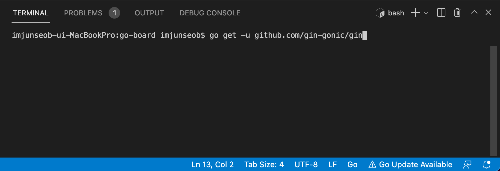  

`go get -u github.com/gin-gonic/gin`를 입력해줍니다.  

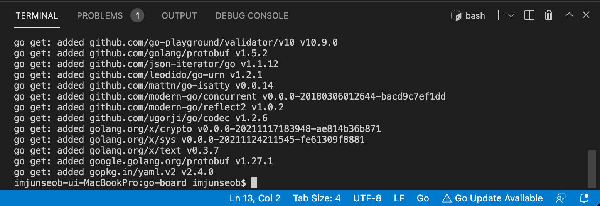  

`-u` 옵션 때문에 종속성 패키지까지 같이 업데이트가 됩니다.  

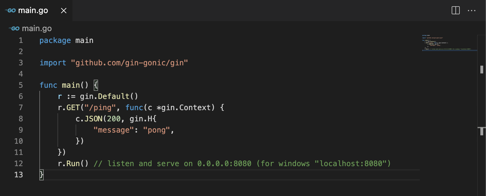  

설치가 완료되면 패키지 import 부분의 에러는 사라집니다.  

`go run main.go`를 통해 정상적으로 작동하는지 확인 합니다.  

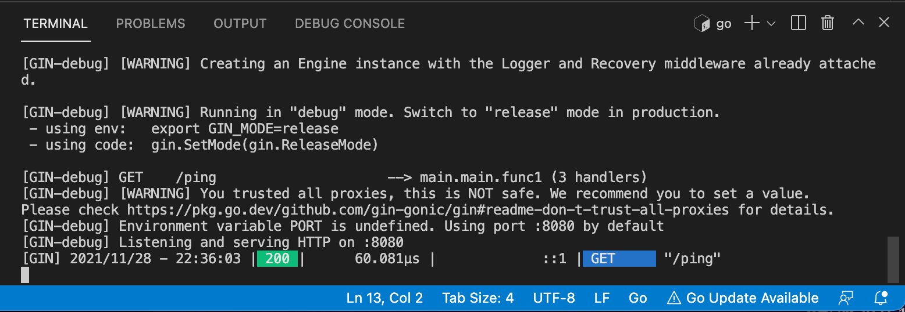  

`http://localhost:8080/hello` 다음의 주소를 웹브라우저를 통해 접속해 테스트 합니다.

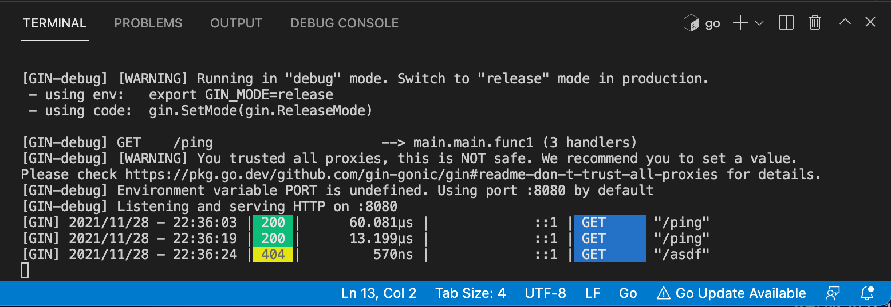  

접속 기록을 gin에서 보여줍니다.  
브라우저를 통해 정상 접근이 되었는지 확인 가능합니다. (응답 코드 200, url은 /ping)

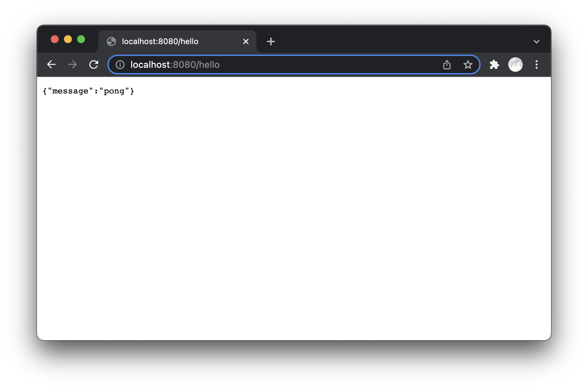  

## 5. 마무리

go를 설치하고, 개발환경을 구축한뒤에 gin 패키지를 설치하여 간단한 웹 서버를 구동시켰습니다.  
이제 go를 이용해 프로젝트를 하러 가봅시다.  