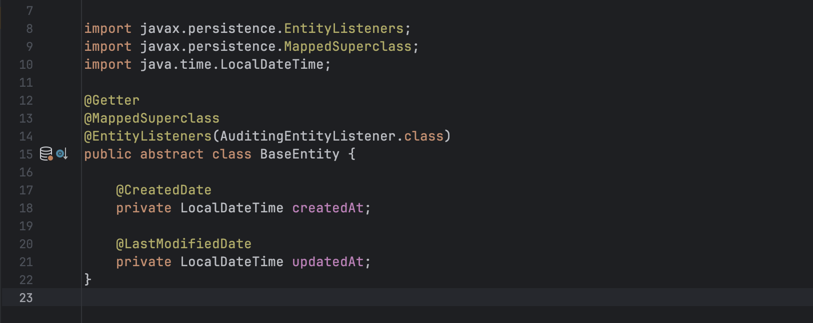

# [Spring] EnableJpaAuditing 사용해보기



## 1. JPA Auditing 이란 무엇인가?

데이터 베이스에 존재하는 테이블들에는 공통적으로 존재하는 데이터들이 있습니다.  
바로 생성 날짜, 마지막 수정 날짜와 같은 컬럼 입니다.   
ORM을 사용하는 경우는 이런 공통 데이터들이 엔티티 마다 중복된 코드들이 존재하게 됩니다.  
만일 공통된 부분의 수정이 있는 경우 관련된 코드를 전부 변경해줘야 합니다.  

그래서 보통은 이런 공통 데이터만을 갖고 있는 엔티티를 별도로 만들고, 이 클래스를 상속 받아 사용합니다.  
다음과 같이 말이죠.

```java
public abstract class BaseEntity {

    private LocalDateTime createdAt;

    private LocalDateTime updatedAt;
}

public class Member extends BaseTimeEntity {
    ...
}
```

이제 공통된 부분에 수정이 필요한 경우 부모 객체만 수정을 하면 되겠네요.  
우선 중복 코드의 문제는 사라졌습니다. 그런데 한가지 문제가 있습니다.  
뭐가 문제일까요? 바로 값을 입력하는 시점에 대한 고민을 해봐야 합니다.  
생성되는 시점, 또는 수정되는 시점에 데이터를 직접 설정해줘야 합니다.  
코드로 확인해볼까요?  

```java
public class Member extends BaseTimeEntity {
    ...

    public void modify(...) {
        this.updatedAt = Datetime.Now();
    }
}
```

수정을 하게되는 경우 (modify 함수 호출)에 날짜를 채워 주도록 합니다.  
하지만 이렇게 수정되는 곳곳마다 코드를 채워줘야하는것은 매우 번거로운 일입니다.  
그래서 JPA 에서는 엔티티 객체가 수정되거나 변경되었을때 자동으로 값을 채워주는 기능이 있습니다.  
이러한 기능을 JPA Auditing 이라고 하며 @EnableJpaAuditing을 통해 사용가능 합니다.  

## 2. @EnableJpaAuditing 사용하기

@EnableJpaAuditing 어노테이션을 사용하기 위해서 의존성을 추가해줍니다.
build.gradle 파일에 다음과 같은 의존성을 추가해줘야 합니다.  

```java
dependencies {
	implementation 'org.springframework.boot:spring-boot-starter-data-jpa'
}
```

그럼 JPA Auditing 기능을 사용해 다시한번 BaseEntity를 작성해봅시다.  

```java
@MappedSuperclass
@EntityListeners(AuditingEntityListener.class)
public abstract class BaseEntity {

	@CreatedDate
    private LocalDateTime createdAt;

	@LastModifiedDate
    private LocalDateTime updatedAt;
}
```

`@MappedSuperclass` 어노테이션은 공통적으로 필요한 속성들을 부모클래스에 선언하고
자식 클래스에서 상속 받을떄 사용합니다.  
클래스 관계로 볼때는 상속관계이나 DB에 저장되는 형태는 상속관계를 따르지 않습니다.  
`BaseEntity`를 상속받은 엔티티들을 실제 DB에 저장후 확인해보면
테이블마다 `BaseEntity`의 데이터가 존재하게 됩니다.  

`@EntityListeners(AuditingEntityListener.class)` 어노테이션은 크게 두개 부분을 확인해봐야 합니다.  
`@EntityListeners` 어노테이션은 JPA 엔티티에서 이벤트 발생시 특정 로직을 수행할수 있도록 하는 어노테이션 입니다.  
`AuditingEntityListener` 클래스는 Spring Data JPA 에서 제공하는 이벤트 리스너입니다.  
`@CreatedDate, @LastModifiedDate` 어노테이션을 탐색해 엔티티 이벤트 발생시 해당 값을 자동으로 채워줍니다.  

```java
@EnableJpaAuditing
@SpringBootApplication
public class EsApplication {

	public static void main(String[] args) {
		SpringApplication.run(EsApplication.class, args);
	}
}
```

그리고 `@EnableJpaAuditing`을 Application 위에 추가 해줍니다.  

```java
public class Member extends BaseEntity {
    ...
}
```

엔티티에 사용할때는 위와 같이 `BaseEntity`를 상속 받아 사용하면 됩니다.  
`@EnableJpaAuditing`을 Application 위에 쓰지 않고, 따로 `@Configuration`으로 분리 할 수도 있습니다.  

```java
@EnableJpaAuditing
@Configuration
public class JpaAuditConfig {
    ...
}
```

그리고 BaseEntity에 수정 시간 외에도 생성자와 수정자도 추가할수 있습니다.  

```java
@CreatedBy
private String createdBy;

@LastModifiedBy
private String modifiedBy;
```

하지만 이경우 유저에 대한 정보를 `Spring Security` 의 `Authentication Context`로 부터 가져옵니다.  
이값을 커스텀 하고 싶은 경우에는 `AuditorAware<T>` 인터페이스를 구현하여 처리 합니다.  
Config에 `@EnableJpaAuditing(auditorAwareRef = "빈 이름")`를 추가해줍니다.  
그리고 `AuditorAware<T>`를 구현해주도록 합니다.  

```java
@EnableJpaAuditing(auditorAwareRef = "auditorProvider")
@Configuration
public class JpaAuditConfig {
    
    @Bean
    public AuditorAware<String> auditorProvider() {
        return new AuditorAwareImpl();
    }
}
```

```java
public class AuditorAwareImpl implements AuditorAware<String> {

    @Override
    public Optional<String> getCurrentAuditor() {
        // 여기서 Spring Security의 Authentication 객체를 가져와 현재 로그인 사용자 정보를 가져와 리턴한다.  
    }
}
```

## 3. 마무리

데이터 베이스가 언제 생성/수정되었는지는 때로는 장애를 해결하는데 아주 중요한 역할을 하기도 합니다.  
스프링에서는 다행히 이러한 기능들을 제공하고 있어서 편리하게 사용할수 있습니다.  
필요에 따라 생성/수정 시간만 필요하는 경우에는 BaseEntity를 분할해서 사용할 수도 있습니다.  
다양한 기능을 프로젝트에 상황에 맞게 사용하시기 바랍니다.  
