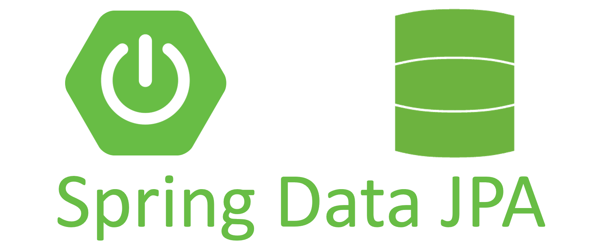
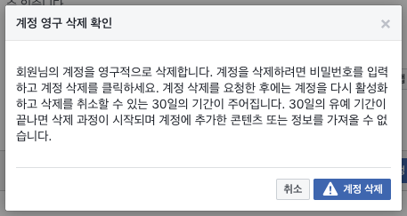
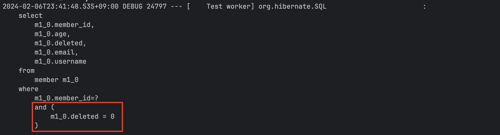
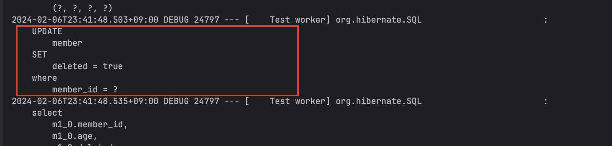
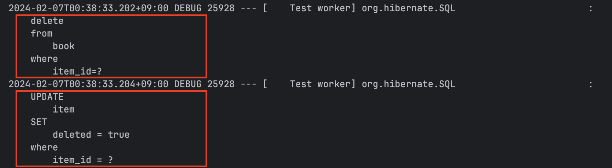
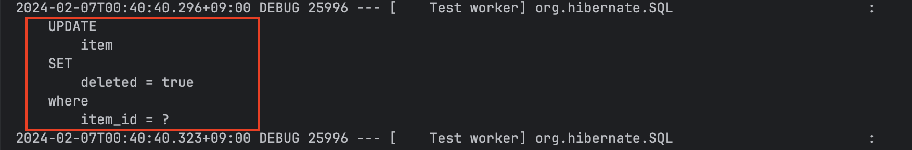

# [JPA] Soft Delete 기능 사용하기



## 1. Soft Delete란?

Soft Delete가 무엇인지를 설명 하기전에 예시를 설명 하도록 하겠습니다!   
만약 우리가 회원 서비스를 개발한다고 생각해보겠습니다.   
회원 가입, 로그인, 계정 잠금 등등 거의 모든 기능을 개발 하였고, 이제 계정 탈퇴만을 남겨둔 상태입니다.  
그런데 고민이 되는 상태입니다. 탈퇴 버튼 클릭시 모든 정보가 삭제되도록 하면, 실수로 삭제하는 경우 복구할 수 없게 됩니다.  

그래서 만약을 대비해서 유저가 계정 탈퇴 버튼을 누르게 되면, 실제 삭제는 하지 않도록 합니다.  
또한 계정을 30일 동안 비활성화 상태로 남겨두어 언제든 계정 복구를 할 수 있도록 합니다.  
다만, 30일이 경과한 경우에는 비활성화 상태에서 실제 삭제가 이뤄지도록 합니다.  



위의 탈퇴 관련 스펙은 주변의 다양한 서비스에서 쉽게 확인 할 수 있습니다.  
그럼 저희는 개발자니까 위에서 얘기 했던, 계정 비활성화 상태에 대해 좀 더 자세히 고민을 해보도록 하겠습니다.  
계정의 비활성화 상태를 위해서 계정 테이블에 `activate` 라는 컬럼을 추가하도록 하겠습니다.  
활성화 상태는 `1`로 비활성화 상태는 `0`을 나타내도록 합니다.  

이제 비활성화 상태에 대한 대략적인 스펙은 정해졌습니다. 그럼 상세 스펙을 정리해보겠습니다.   
최초 회원 가입시에는 활성화 상태로 데이터를 추가합니다. 이후 유저는 서비스를 계속 이용합니다.  
그러다가 더이상 서비스를 이용할 필요가 없어져 계정 탈퇴를 한다고 생각해 보겠습니다.  
계정을 탈퇴할때 실제 데이터를 삭제 하면 계정 복구를 할수 없게 되기 때문에 실제 데이터를 삭제 하지 않습니다.  
다만 활성화 상태를 비활성화로 변경합니다. 이렇게 되면 탈퇴를 신청한 회원의 정보를 쉽게 알 수 있습니다.  

또한 30일 이내에 언제든 계정을 복구 할 수 있고, 30일이 경과한 경우는 실제 데이터를 삭제합니다.   
계정 탈퇴 신청후 30일 이내 로그인 하는경우 게정 탈퇴 철회 기능을 추가하고, 철회시 다시 활성화 상태로 변경합니다.   
30일이 지난 경우 실제 데이터를 삭제하는 것을 별도 스케줄러가 비활성화 상태를 체크해 삭제 하도록 합니다.   
30경과 체크는 마지막 로그인 날짜 같은 컬럼이 있다고 가정하고 진행하도록 합니다.  

얼핏 보면 활성화/비활성화 상태를 통한 회원의 탈퇴 개발이 매우 간단하게 완료된 것 같습니다.  
하지만 잘 생각해봐야 할게 있습니다. 회원을 조회 하는 경우 비활성화 상태의 회원은 조회되면 안됩니다.   
아니 모든 조회 로직에서 비활성화 상태의 회원은 제외 해야 합니다.  
조회 로직이 단 하나라면 간단하게 해결되겠지만, 실무에서 로직은 그렇게 간단할리 없습니다.  
따라서 모든 조회 로직에 비활성화 상태의 회원은 조회가 되지 않도록 조건을 모두 추가해줘야 할까요?  

자! 좀 더 깊은 내용은 이따 설명 드리도록 하고, 원래 알아보기로 했던 Soft Delete에 대해서 알아볼까요?   
라고 하면, 여러분은 아마 그렇지 않아도 된다고 하실겁니다!   
왜냐하면 위에 설명에서 저는 Soft Delete에 대해 설명을 드렸기 때문입니다.  
Soft Delete는 위의 회원 비활성화 상태를 둔것과 같이 실제 데이터를 삭제하지 않고,  
삭제시 특정 컬럼만 변경하여, 마치 데이터가 삭제된 것처럼 처리 하는 방법 입니다.  
그리고 실제 데이터를 삭제해야 하는 경우 실제로 데이터를 삭제 하도록 합니다.  

그럼 JPA에서 어떻게 Soft Delete를 사용하는지 예제 코드로 확인 해보도록 하겠습니다.   

## 2. Soft Delete 사용 하기

우선 Soft Delete 여부를 확인 하기 위해서 회원 엔티티에 컬럼 하나를 추가해 주도록 하겠습니다.   

```java
private boolean deleted = Boolean.FALSE;
```
회원 가입을 완료(계정 생성) 하면 위 활성화 상태이므로 `deleted` 컬럼의 초기값을 `false`로 설정하도록 합니다.   
이제 삭제사에 실제로 데이터를 삭제 하지 않고, `deleted` 컬럼만 `true`로 변경하도록 해야합니다.  
그럼 삭제시에 삭제 하지 않고 `deleted` 컬럼만 변경하도록 하는 방법에는 무엇이 있을까요?  
QueryDsl을 사용하거나 JPQL을 사용해 삭제 로직을 업데이트 로직으로 변경하도록 하는 방법도 있습니다.  
하지만 좀더 간편한 방법에 대해 알아 볼까요?  

```java
@SQLDelete(sql = "UPDATE member SET deleted = true where member_id = ?")
```

바로 `@SQLDelete` 어노테이션을 통해 삭제 로직을 업데이트 로직으로 변경하는 방법이 있습니다.   
위의 로직을 사용하면, `deleted` 컬럼만 업데이트 하고 실제 데이터를 삭제 하지 않습니다.   

이제 삭제시 실제 데이터가 삭제 되지 않도록 하였습니다.  
하지만 문제가 하나 더 남앗습니다. 바로 조회시 `delete` 컬럼이 `false`인경우만 조회 하도록 해야합니다.   
JPA에서는 역시 어노테이션을 통해 이를 제공 하고 있습니다.   
바로 `@SQLRestriction` 어노테이션 입니다.  

```java
@SQLRestriction("deleted = false")
```
사용법은 다음과 같이 조건을 명시해 주면 where 절에 해당 조건으로 같이 조회하게 됩니다.   
이렇게 된다면 조회시 `deleted`컬럼이 `false`인 데이터만 조회할 수 있습니다.   

참고로 스프링 부트 3버전을 기준으로`@Where`이 Deprecated 됨에 따라 `@SQLRestriction` 를 대신 사용 합니다.   
`@Where` 어노테이션과 마찬가지로 where절에 설정한 쿼리가 추가로 나가도록 하는 기능을 제공합니다.   

회원 엔티티의 전체 코드는 다음과 같습니다.  

```java
@Getter
@Entity
@SQLDelete(sql = "UPDATE member SET deleted = true where member_id = ?")
@SQLRestriction("deleted = false")
@NoArgsConstructor(access = AccessLevel.PROTECTED)
public class Member {

    @Id
    @GeneratedValue(strategy = GenerationType.IDENTITY)
    @Column(name = "member_id")
    private Long id;

    private String username;
    private String email;
    private int age;

    private boolean deleted = Boolean.FALSE;

    ...
}
```

그럼 테스트를 통해 Soft Delete 기능이 제대로 작동하는지 확인 해보도록 하겠습니다.   

```java
@Test
@Transactional
@DisplayName("조회")
public void searchMemberTest() {
    //given
    Member member = memberRepository.save(createMember("asdf", "asdf@test.com", 25));

    //when
    em.flush();
    em.clear();

    Member findMember = memberRepository.findById(member.getId())
            .orElseThrow(IllegalArgumentException::new);

    //then
    assertEquals(member.getUsername(), findMember.getUsername());
}
```



```java
@Test
@Transactional
@DisplayName("soft delete 테스트")
public void softDeleteTest() {
    //given
    Member member = memberRepository.save(createMember("asdf", "asdf@test.com", 25));

    //when
    memberRepository.delete(member);
    em.flush();
    em.clear();

    //then
    assertThrows(IllegalArgumentException.class, () -> memberRepository.findById(member.getId())
            .orElseThrow(IllegalArgumentException::new));
}
```



## 3. 상속관계 에서 Soft Delete 기능 사용하기

```java
@Getter
@Entity
@Inheritance(strategy = InheritanceType.JOINED)
@SQLDelete(sql = "UPDATE item SET deleted = true where item_id = ?")
@SQLRestriction("deleted = false")
@DiscriminatorColumn
public abstract class Item {

    @Id
    @GeneratedValue(strategy = GenerationType.IDENTITY)
    @Column(name = "item_id")
    private Long id;

    @Setter(AccessLevel.PROTECTED)
    private String name;

    @Setter(AccessLevel.PROTECTED)
    private int price;

    private boolean deleted = Boolean.FALSE;
}
```

```java
@Getter
@Entity
@NoArgsConstructor(access = AccessLevel.PROTECTED)
@DiscriminatorValue("ALBUM")
public class Book extends Item {

    private String author;
    private String isbn;

    ...
}
```




```java
@OnDelete(action = OnDeleteAction.CASCADE)
public class Book extends Item {
    ...
}
```

상속 관게에서 Soft delete 기능을 사용 하기 위해서는 `@OnDelete` 어노테이션을 통해서 자식 클래스에서도 실제 삭제가 일어나지 않도록 한다.   
만일 상속 관계에서 위의 코드를 추가 하지 않으면, 실제 데이터가 삭제되므로 주의 하도록 한다.   

