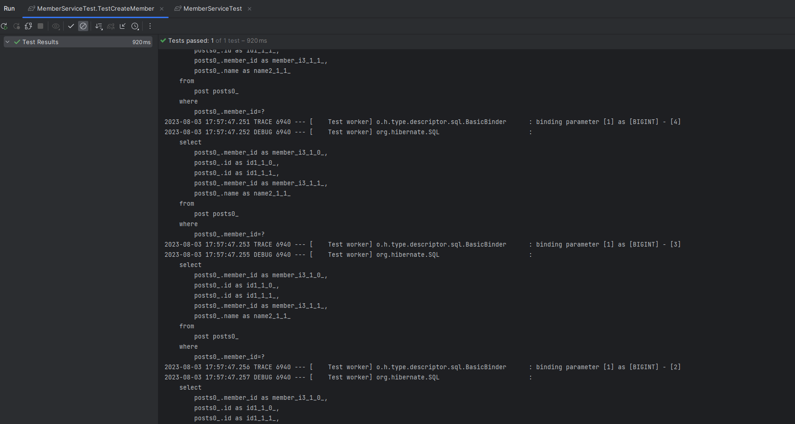

# JPA N+1 문제 해결하기



## 1. N+1 문제란 무엇인가?

N+1 문제란? 연관관계가 설정된 데이터를 조회할때 방생하는 문제입니다.  
데이터가 `유저-게시글`의 연관관계를 가지고 있다고 생각해보겠습니다.  

유저 데이터를 조회하는 요청이 왔을때 유저 데이터를 우선적으로 조회하게 됩니다.   
또한 유저와 연관관계를 가지고 있는 게시글 역시 조회 하게 됩니다.  
N+1 문제는 이때 조회의 대상이 되는 데이터(게시글)의 연관관계 데이터를 모두 조회 하며 발생하게 됩니다.   

유저 100명을 조회 하는데, 게시글은 조회를 하지 않았으니, 유저마다 가지고 있는 게시글을 전부 조회해야 합니다.  
유저 100명을 조회하는 쿼리가 1이며, 게시글을 조회를 쿼리가 100번만큼 발생합니다. 이를 N이라고 합니다.  
N+1 문제는 데이터 조회하는 쿼리(1)의 데이터의 갯수 N 만큼 연관관계의 조회 쿼리가 추가로 발생하는 문제입니다.     
어떤분들은 1+N 문제라고 말씀하시는 분들도 있는데 동일한 의미입니다.  

그럼 이게 왜 문제가 되는지 아직 감이 안오시는분들이 있을수도 있습니다.   
데이터를 조회하는 쿼리에서 결과가가 1-2개인 경우 10개의 추가 쿼리가 발생하게 됩니다.   
아직까지는 괜찮다고 볼수도 있습니다. 총 2개-4개의 쿼리가 발생할테니까요.   
하지만 조회한 데이터의 결과가 1만개인 경우는 어떨까요?   
네 하나의 조회 요청에 1+1만개 만큼의 쿼리가 발생하게 됩니다.  
이러한 조회 요청이 수시로 들어오게 되면, 결국 데이터 베이스는 부하를 감당하지 못하게 됩니다.  
클라우드 환경에서는 리소스를 엄청나게 사용하게되어 의도하지 않은 엄청난 과금을 맛볼수 있습니다.  

## 2. N+1 문제 데이터

앞서 우린 N+1 문제가 무엇인지 알아봤습니다.  
그럼 좀 더 쉽게 알아보기 위해서 두개의 테이블과 코드를 가지고 설명을 하도록 하겠습니다.  
설명에 사용할 테이블은 사용자 테이블과 팀 테이블 2개입니다.   

사용자(User) 테이블

| User | Type |
|:----:|:----:|
| id   | Long   |
| name | String | 
| post | List\<post\>   |

게시글(Post) 테이블

| Post | Type |
|:----:|:----:|
| id   | Long   |
| name | String | 
| users | User  |

사용자는 여러개의 게시글을 가질수 있지만, 게시글은 한명의 사용자만을 가질수 있습니다.  
즉, 사용자와 게시글은 일대다의 연관관계를 가지고 있습니다.   

| 유저 | 게시글들 |
|:-----:|:-----:|
| 사람1 | 글1, 글2, 글3, 글4, ... |

게시글과 사용자는 `@ManyToOne` 연관관계를 가진다.   
사용자와 게시글은 `@OneToMany` 연관관게를 가진다.  
예제에서는 정말 필요한 N+1 문제를 확인하기 위해, 단방향 연관관계라고 하겠습니다.  

테이블을 클래스로 나타내면 다음과 같습니다.  

```java
@Entity
public class Member {

    @Id
    @GeneratedValue
    private long id;

    private String name;

    @OneToMany(mappedBy = "member", fetch = FetchType.EAGER) // 즉시 로딩
    private List<Post> posts = new ArrayList<>();
}
```

```java
@Entity
public class Post {

    @Id
    @GeneratedValue
    private long id;

    private String name;

    @ManyToOne
    private Member member;
}
```

## 3. N+1 문제 발생 시키기

예제에서는 N+1을 발생시켜야 하므로 즉시로딩을 사용하도록 하겠습니다.  
로딩 방식에는 지연 로딩/즉시 로딩이 있습니다.  

```java
@OneToMany(mappedBy = "member", fetch = FetchType.EAGER) // 즉시 로딩
private List<Post> posts = new ArrayList<>();
```

방금 위에서 우리는 `FetchType.EAGER` 으로 설정해주었는데요.  
지연 로딩으로 설정하려면 다음과 같이 `FetchType.LAZY`으로 설정 해야 합니다.   

그럼 지연 로딩/즉시 로딩의 차이에 대해 알아보도록 할까요?   
즉시 로딩의 경우 데이터를 조회할때 연관된 데이터까지 한번에 불러오는 방법입니다.  
유저 데이터를 조회하는 경우 게시글까지 `즉시` 조회하는 방식 입니다.  

지연 로딩은 데이터 조회시 연관된 데이터를 `즉시` 조회하지 않고, 나중에(`지연`) 가져오는 방식 입니다.  
디자인 패턴중 `싱글톤 패턴` 에서의 `늦은 초기화`를 생각해보시면 이해가 빠를것 같습니다.   
선언과 동시에 초기화를 하지않고, 사용할때 초기화하여 사용하는 `늦은 초기화`와 동일합니다.  

유저 데이터를 조회하는 경우, 데이터 베이스에서 유저 데이터를 조회를 해서 가져옵니다.  
하지만 게시글 데이터는 바로 가져오지 않고, 연관 데이터에 프록시 객체(임시 객체)를 생성후 설정해놓습니다.  
그리고 연관된 데이터를 참조하는 시점(실제 사용 시점)에 객체를 가져오는 방법입니다.   
즉, 지연 로딩은 연관관계로 맺어진 데이터중 일부만 실제로 조회 합니다.   
그리고 일부 데이터에는 임시 객체를 넣어 놓고 실제 사용하는 시점에 조회해 오는 방식입니다.  

전체 유저를 조회해보기 전에, N+1 문제를 눈으로 확인하기 위해 설정 하나를 추가해주도록 해보겠습니다.  
실제 구동되는 쿼리를 눈으로 보기 위해서 `application.yaml` 파일에 아래 내용을 추가해줍니다.  

```yaml
spring:
  jpa:
    properties:
      hibernate:
        show_sql: true    # 수행되는 SQL문을 보여준다.
        format_sql: true  # 수행되는 SQL을 보기 쉽게 출력해준다.
```

이제 전체 유저를 조회해봅니다.  

```java
memberRepository.findAll();
```

이제 실제 수행된 쿼리문을 확인해보겠습니다.  

```sql
...

2023-08-03 17:57:47.250 DEBUG 6940 --- [Test worker] org.hibernate.SQL : 
    select
        posts0_.member_id as member_i3_1_0_,
        posts0_.id as id1_1_0_,
        posts0_.id as id1_1_1_,
        posts0_.member_id as member_i3_1_1_,
        posts0_.name as name2_1_1_ 
    from
        post posts0_ 
    where
        posts0_.member_id=?
2023-08-03 17:57:47.252 DEBUG 6940 --- [Test worker] org.hibernate.SQL : 
    select
        posts0_.member_id as member_i3_1_0_,
        posts0_.id as id1_1_0_,
        posts0_.id as id1_1_1_,
        posts0_.member_id as member_i3_1_1_,
        posts0_.name as name2_1_1_ 
    from
        post posts0_ 
    where
        posts0_.member_id=?
2023-08-03 17:57:47.255 DEBUG 6940 --- [Test worker] org.hibernate.SQL : 
    select
        posts0_.member_id as member_i3_1_0_,
        posts0_.id as id1_1_0_,
        posts0_.id as id1_1_1_,
        posts0_.member_id as member_i3_1_1_,
        posts0_.name as name2_1_1_ 
    from
        post posts0_ 
    where
        posts0_.member_id=?

...
```

눈치채셨나요?     
실제로 유저를 조회하는 쿼리 1개만 나갈것으로 예상했지만,   
다수의 게시글을 조회하는 쿼리가 나간것을 확인할수 있습니다.  
총 유저를 조회하는 쿼리 (1개) + 게시글을 조회하는 쿼리 (N개)가 발생하였습니다.  

```sql
2023-08-03 17:57:47.209 DEBUG 6940 --- [Test worker] org.hibernate.SQL : 
    select
        member0_.id as id1_0_,
        member0_.email as email2_0_,
        member0_.password as password3_0_,
        member0_.username as username4_0_ 
    from
        member member0_
```

단, 유저를 조회 하는 쿼리는 1개만 발생하였습니다.   
그럼 저 위의 쿼리는 다수의 쿼리는 무슨 쿼리일까요?   
네! 바로 유저와 일대다 연관관계를 맺고 있는 `Post` 테이블 입니다.  
그러면 왜 저렇게 다수의 쿼리가 발생한것일까요?   

유저는 여러개의 게시글을 가지고 있습니다. 유저-게시글은 다대일의 관계를 가지고 있습니다.   
유저를 조회하는 경우 유저의 게시글들 역시 조회 해야 합니다.  
유저가 10명이고 각 유저는 게시글 10개를 가지고 있다면, 게시글 조회 쿼리가 유저마다 1개씩 발생합니다.  
당연히 유저마다 가지고 있는 게시글은 전부 다를테니까요.   
만일 유저가 1000명이면 총 1000개의 추가 쿼리가 발생하개 됩니다.   
1+N 문제 라고도 불리는 이유가 바로 이겁니다. 1개의 쿼리에서 추가로 N개의 쿼리가 발생하니까요.   

N+1 문제는 N과 1이 의미하는 바는 바로 다음과 같습니다.   
N (각 유저의 게시물을 조회하는 쿼리) + 1 (유저들을 조회하는 쿼리)   

## 4. N+1 문제 고민해보기

그럼 무엇이 문제였을까요? 즉시 로딩이 문제였을까요?   
한번 즉시 로딩을 지연 로딩으로 변경해보겠습니다.  

```java
@OneToMany(fetch = FetchType.EAGER)
```

`EAGER` 를 `LAZY`로 변경해주도록 하겠습니다.  

```java
@OneToMany(fetch = FetchType.LAZY)
```

또다시 전체 팀원을 조회해보겠습니다.  

```java
List<Team> teams = teamRepository.findAll();
```

이제 해결되었을까요? 언뜻 보면 크게 문제가 없어보입니다.  
하지만 잘생각해볼 필요가 있습니다. 우리는 `즉시 로딩`을 `지연 로딩` 으로 바꾸었을 뿐입니다.  
지연로딩은 연관된 데이터(소속된 팀원)를 참조하기 전까지는 쿼리가 수행되지 않습니다.   

만일 로딩되는 시점에 게시글 객체를 사용하지 않았다면, N+1 문제가 발생하지 않았을 수도 있습니다.  
하지만 조회된 유저들의 게시글의 제목을 모아 본다면 바로 N+1 문제가 발생하는것을 볼수있습니다.   
그래서 언뜻보면 N+1 문제가 해결된 것처럼 보이는 것입니다.  
실제 N+1 문제가 해결되었는지 확인하기 위해서 연관된 데이터 사용하는 코드를 추가해보겠습니다.   

```java
team.getUsers.forEach(user -> {
    System.out.Println(user.getTeam.getName() + " : " + user->getName());
});
```

추가할 코드는 유저의 게시글의 제목을 모아 보는 코드 입니다.  
그럼 제일 중요한 실제 수행되는 쿼리문을 한번 보겠습니다.

```sql

...
2023-08-03 18:13:33.225 DEBUG 6940 --- [Test worker] org.hibernate.SQL : 
    select
        posts0_.member_id as member_i3_1_0_,
        posts0_.id as id1_1_0_,
        posts0_.id as id1_1_1_,
        posts0_.member_id as member_i3_1_1_,
        posts0_.name as name2_1_1_ 
    from
        post posts0_ 
    where
        posts0_.member_id=?
...

```

네 맞습니다. N+1 문제가 발생하였습니다.   
그럼 왜 지연로딩으로 바꾸었는데도 N+1 문제가 발생하였을까요?   
이유는 바로 로딩 방식만 변경하였기 떄문 입니다.  
로딩을 조금 늦게 하여 유저 데이터를 조회 하는 시점에 N개의 쿼리를 발생 시키지 않을 뿐입니다.   
결국 게시글들의 정보를 사용하는 순간에는 조회를 해야합니다. 그러기 위해서는 결국 추가 쿼리가 필요합니다.    
그럼 어떻게 해야 N+1 문제를 해결할 수 있을까요?   

## 5. N+1 문제 해결 방안

처음으로 돌아가서 우리가 하려던 것은 무엇이었을까요?   
데이터를 조회하려고 했고, 조회하려는 데이터의 연관관계에 있는 데이터를 조회하였습니다.  
그 과정에서 `N+1` 문제가 발생한것입니다.  
좀 더 원론적으로 들어가서 만약 순수 SQL로 데이터를 조회하려 하였다면, 어떻게 했을까요?  
바로 `SELECT * FROM member LEFE JOIN post ON member.post_id = post.id` 다음과 같은 쿼리를 이용헀을 것입니다.  
이것을 ORM을 통해 해결하려다 보니 `N+1`문제가 발생한것 입니다.  

* 연관된 데이터를 조인하여 한번에 가져온다.  
* 유저의 게시글을 모아서 한번에 조회한다.  

### 5.1. FetchJoin

### 5.2. EntityGraph

### 5.3. BatchSize

## 6. N+1 문제 돌아보기