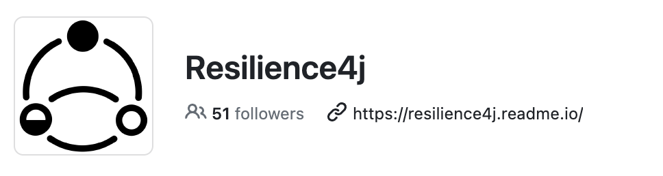

# [Spring] Resilience4j 소개 및 예제

## 1. Resilience4j 이란?

Resilience4j는 서킷 브레이커 기능을 제공하는 라이브러리 입니다.   
그럼 왜? Resilience4j일까요? 사실 이전에 Hystrix라는 것이 존재하였습니다.  
하지만 지금은 Hystrix에서 Resilience4j로 넘어가는 추세인것 같습니다.   
그 이유는 좀더 나중에 알아보도록 하고, 우선 서킷 브레이커가 무엇인지에 대해 알아도록 할까요?   

### 1.1. 서킷 브레이커란 무엇인가?

서킷 브레이커가 무엇인지 알기전에 이해가 쉽도록 예시를 먼저 들어보도록 하겠습니다.   
MSA에서는 여러개의 마이크로 서비스로 구성되어 있고, 하나의 요청에 내부의 여러개의 요청이 발생합니다.   
이때 하나의 요청에서 장애가 발생 한다면 사용자는 서비스 이용에 어려움을 겪게 됩니다.  
하지만 우리의 아키텍쳐는 MSA 입니다. 하나의 서비스에서 장애가 발생하더라도 전체로 퍼지지는 않습니다.  

예를들어 개시판에서 게시글에 대한 좋아요/싫어요를 담당하는 공감 서비스에 장애가 발생헀다고 가정합니다.   
장애가 발생한것은 공감 서비스이므로 피드의 게시물이 보이지 않는 경우는 발생하지 않을것입니다.   
그럼 공감 서비스에 장애가 발생하게 직전을 조금 생각해보겠습니다.  
다양한 이유가 있곘지만 예를들어 트래픽이 몰리는 경우와 특정 처리를 하다가 장애가 발생한 경우가 있을것입니다.  

현재 장애가 발생하지 않는 상황에서 현재 10번의 요청에 대해서 절반정도 성공하고, 절반은 실패한다고 생각해보겠습니다.   
트래픽이 몰리는 경우 앞으로 트래픽이 몰리는 경우가 많을 것입니다. (최고점이 아닌 경우라고 가정)   
그리고 특정 처리를 하다가 실패가 난경우, 재시도를 하게될 것이고 재시도를 하게되면서 요청은 점점 더 발생하게 될것입니다.   
이경우 앞으로의 장애 발생 확률이 높다고 볼수있곘죠.  
이때 장애가 추가적으로 발생하는것을 막기 위해서 특정 동작으로 수행할 수 있도록 하면 얼마나 좋을까요?   
