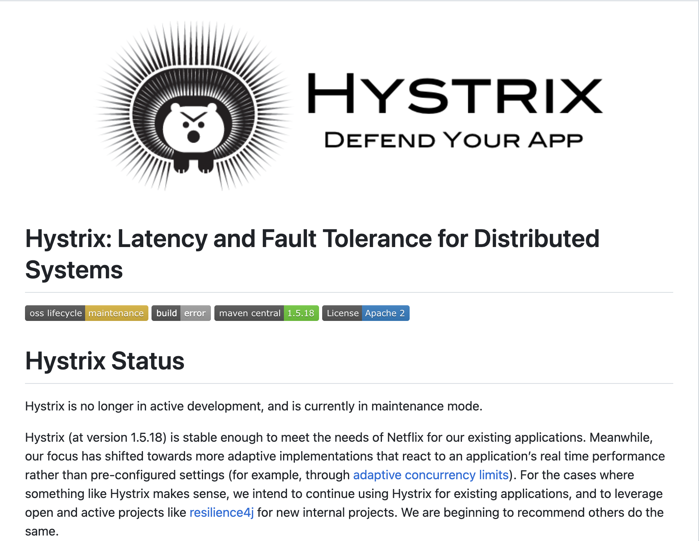

# [Spring] Resilience4j 소개 및 예제


## 1. Resilience4j 이란?

Resilience4j는 서킷 브레이커 기능을 제공하는 라이브러리 입니다.   
그럼 왜? Resilience4j일까요? 사실 이전에 Hystrix라는 것이 존재하였습니다.  
하지만 지금은 Hystrix에서 Resilience4j로 넘어가는 추세인것 같습니다.   
그 이유는 좀더 나중에 알아보도록 하고, 우선 서킷 브레이커가 무엇인지에 대해 알아도록 할까요?   

### 1.1. 서킷 브레이커란 무엇인가?

서킷 브레이커가 무엇인지 알기전에 이해가 쉽도록 예시를 먼저 들어보도록 하겠습니다.   
MSA에서는 여러개의 마이크로 서비스로 구성되어 있고, 하나의 요청에 내부의 여러개의 요청이 발생합니다.   
이때 하나의 요청에서 장애가 발생 한다면 사용자는 서비스 이용에 어려움을 겪게 됩니다.  
하지만 우리의 아키텍쳐는 MSA 입니다. 하나의 서비스에서 장애가 발생하더라도 전체로 퍼지지는 않습니다.  

예를들어 개시판에서 게시글에 대한 좋아요/싫어요를 담당하는 공감 서비스에 장애가 발생헀다고 가정합니다.   
장애가 발생한것은 공감 서비스이므로 피드의 게시물이 보이지 않는 경우는 발생하지 않을것입니다.   
그럼 공감 서비스에 장애가 발생하게 직전을 조금 생각해보겠습니다.  
다양한 이유가 있곘지만 예를들어 트래픽이 몰리는 경우와 특정 처리를 하다가 장애가 발생한 경우가 있을것입니다.  

현재 장애가 발생하지 않는 상황에서 현재 10번의 요청에 대해서 절반정도 성공하고, 절반은 실패한다고 생각해보겠습니다.   
트래픽이 몰리는 경우 앞으로 트래픽이 몰리는 경우가 많을 것입니다. (최고점이 아닌 경우라고 가정)   
그리고 특정 처리를 하다가 실패가 난경우, 재시도를 하게될 것이고 재시도를 하게되면서 요청은 점점 더 발생하게 될것입니다.   
이경우 앞으로의 장애 발생 확률이 높다고 볼수있곘죠.  
이때 장애가 추가적으로 발생하는것을 막기 위해서 특정 동작으로 수행할 수 있도록 하면 얼마나 좋을까요?   

앞서 설명 드린 것처럼 게시글을 조회하는데 공감 서비스에 장애가 생기는 경우 전체 페이지 로드가 느려지는 것과  
공감 내용은 보이지 않더라도 게시글은 빠르게 보이는것중 어느것이 좀더 나을까요?  
바로 공감 내용은 보이지 않더라도 원래 목적인 게시글이 보이는것이 좀더 나을것 입니다.   

서킷 브레이커 또한 다음과 같은 개념에서 도입되었습니다.   
서킷 브레이커는 누전차단기인데 이것이 무슨 연관이 있냐고 하실수도 있습니다.   
전류가 정상적으로 흐르지 않고 과도한 전류가 흐르거나 누전이 되는 경우 더 큰 문제가 발생할 수 있습니다.  
이때 누전 차단기는 전류는 차단 함으로써 더 큰문제를 방지 합니다.   
서킷 브레이커 역시 더 큰 장애가 발생하기 전에 장애의 전파를 막고자 하는 의도 에서 만들어졌습니다.   

현재 서비스에 장애가 발생할때 추가적인 연쇄 장애를 방지하기 위해 특정 동작을 수행하도록 하는것이 바로 서킷 브레이커 입니다.   

### 1.1. Hystrix를 사용하지 않은 이유



앞서 Resilience4j 이전 Hystrix라는 라이브러리가 존재했다고 하였습니다.   
Hystrix가 아닌 Resilience4j가 사용해야 되는 이유는 Hystrix가 maintenance mode (유지보수 모드)이기 때문입니다.  
위의 사진은 Hystrix 레포지토리의 사진 입니다. 첫번째 줄에 maintenance mode임을 알리고 있습니다.   
따라서 Resilience4j 에서 제공하는 새롭고 안정적인 기능을 사용하도록 합니다.   

## 2. Resilience4j 예제

### 2.1. Resilience4j 소개

Resilience4j는 circuit-breaker 뿐만 아니라 Retry등 다양한 기능을 Core Module로 제공하고 있습니다.   
Core Module은 총 6가지로 구성되어 있으며 간단히 살펴보겠습니다.   

|Core Modules|기능|
|------|---|
|CircuitBreaker|장애 발생시 장애전파되는것을 방지|
|Bulkhead|동시 실행 횟수를 제한|
|RateLimiter|일정시간 동안 요청 제한|
|Retry|요청 실패시 재시도 설정|
|TimeLimiter|요청 호출 시간을 제한|
|Cache|결과 캐싱 기능|

6가지의 기능중 CircuitBreaker는 CLOSED, OPEN, HALF_OPEN 세가지의 일반적인 상태를 가지고 있으며,   
두개의 특별한 상태인 DISABLED, FORCED_OPEN를 가지고 있습니다.   
각각의 상태는 다음 그림 처럼 조건에 따라 다음과 변경되며 각각에 맞는 동작을 수행합니다.   


그럼 각각의 상태가 의미하는 바를 보도록 하겠습니다.   

|상태|설명|
|---|---|
|CLOSED|서킷 브레이커의 상태가 닫힌 상태로 정상적인 상황|
|OPEN|서킷 브레이커의 상태가 열린 상태로 장애가 발생해 서킷 브레이커가 동작하는 상황|
|HALF_OPEN|서킷 브레키어의 상태가 열린 상태로 일정 시간이 지난 상태|

우선 OPEN, CLOSED에 대해서 살펴보면 CLOSED는 부정적인 의미로 장애 상황일 것 같습니다.  
반대로 OPEN은 긍정적인 뜻으로 정상 상황일 것 같습니다.  
하지만 반대 입니다. 장애 상황에 대해서 바라보지 않고, 서킷 브레이커의 활성/비활성 상태로 생각하시면 이해가 빠릅니다.  
서킷 브레이커가 OPEN이 되는 경우는 장애가 발생한 경우, 반대로 CLOSED된 경우는 장애가 없는 상황입니다.   
의미가 헷갈릴수 있으나 확실하게 이해하고 계시는게 좋습니다.   
HALF_OPEN은 반만 열린 상태로 이후 상황에 따라 다시 OPEN될수도 CLOSED될수도 있습니다.   

그럼 상태를 변경하는 기준은 어떻게 될까요? 상태를 변경하는 기준은 크게 두가지 입니다.   
시간 기반과 횟수 기반이 있습니다. 이것을 가지고 슬라이딩 윈도우알고리즘을 통해 상태를 변경합니다.  
tcp 프로토콜에서의 그 슬라이딩 윈도우가 바로 맞습니다.  
[슬라이딩 윈도우](https://en.wikipedia.org/wiki/Sliding_window_protocol) 슬라이딩 윈도우에 대해 자세히 알고싶으시면 이 문서를 참고 하시기 바랍니다.   

시간 기반의 경우 특정 시간동안 요청된 갯수 중 몇%이상이 실패인 경우 서킷 브레이커를 OPEN 합니다.  
반대로 횟수 기반의 경우 몇회의 요청중 몇%이상이 실패인 경우 서킷 브레이커를 OPEN 합니다.  
시간 기반과 횟수 기반은 결국 슬라이딩 윈도우 크기를 결정하는 방식입니다.   
결국 전체의 요청중 장애 상황으로 구분할 실패 요청 갯수를 통해 장애 상황을 판단하게 됩니다.  

### 2.2 예제

그럼 이제 서킷 브레이커를 예제 코드로 한번 살펴보도록 하겠습니다.   

```gradle
	implementation 'org.springframework.boot:spring-boot-starter-aop'
	implementation 'org.springframework.cloud:spring-cloud-starter-circuitbreaker-resilience4j'
```

우선 build.gradle에 의존성을 추가해주도록 합니다.   
주의해야할 사항이 aop 를 반드시 추가해주어야 합니다.  
실무 프로젝트에서는 aop가 자주 사용되지만, 학습을 위한 경우 aop 를 추가하지 않아 서킷 브레이커가 에상대로 작동되지 않았던 경험이 있습니다.   