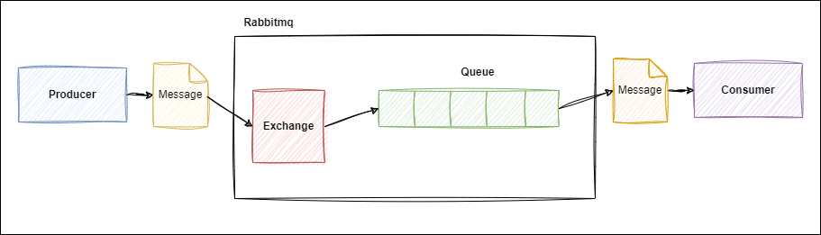
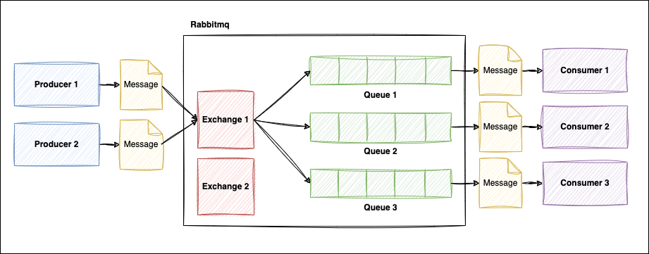

# [Spring] Rabbitmq 연동하기 및 예제

## 1. Rabbitmq란 무엇인가?

RabbitMQ는 AMQP를 기반으로하는 Message Broker입니다.   
그럼 AMQP는 무엇일까요? Advanced Message Queuing Protocol의 약자입니다.  
AMQP 자체가 메세지 큐에대한 프로토콜입니다.  
메세지 큐 방식은 통신할때 데이터를 직접적으로 전달하지 않습니다.  
대신에 큐에 데이터를 송신하고, 수신하는 쪽에서는 큐에 있는 데이터를 가져오는 방식입니다.  

|타입|동작|
|---|---|
|Direct|라우팅 키가 일치하는 큐에 메시지 전달|
|Fanout|Exchange에 bind되어있는 모든 큐에 메시지 전달|
|Headers|key, value로 이뤄진 header에 일치하는 큐에 메시지 전달|
|Topic|라우팅 키 패턴이 일치하는 Queue에 메시지 전달 (*, #등 사용가능)|

### 1.1 Rabbitmq 설치하고 살펴보기

### 1.2. Rabbitmq 사용 이유

## 2. Rabbitmq 연동하기 및 예제

### 2.1. Rabbitmq 예제 설명

### 2.2. Rabbitmq 실습

### 2.3. Rabbitmq 테스트
