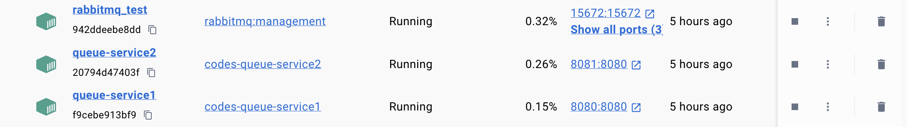
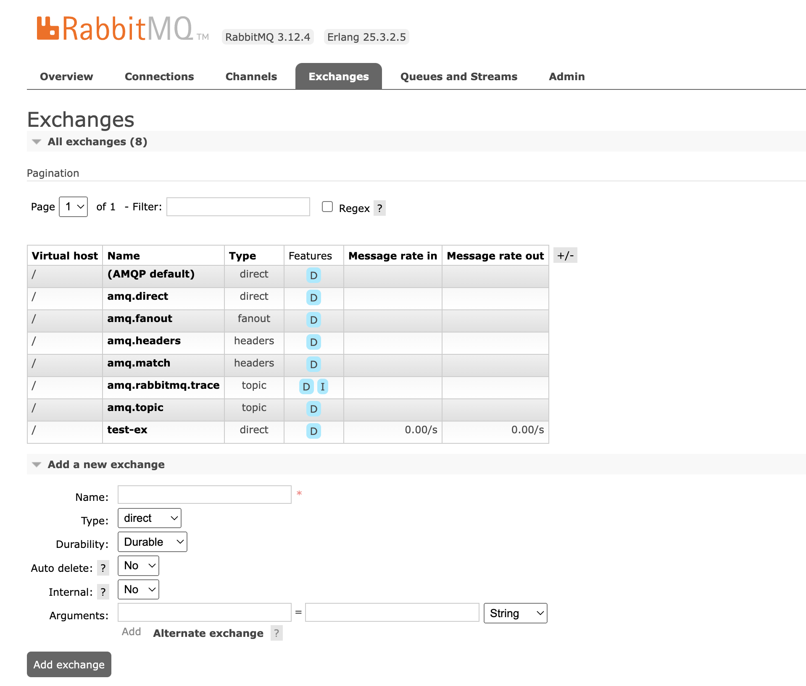
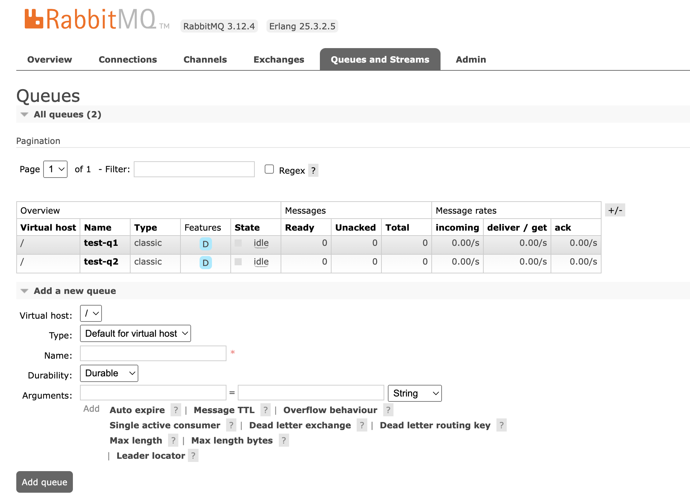

# [Spring] Rabbitmq 연동하기 및 예제

## 1. Rabbitmq란 무엇인가?

### 1.1 Rabbitmq 설치하고 살펴보기

### 1.2. Rabbitmq 사용 이유

## 2. Rabbitmq 연동하기 및 예제

### 2.1. Rabbitmq 예제 설명

### 2.2. Rabbitmq 실습

### 2.3. Rabbitmq 테스트
