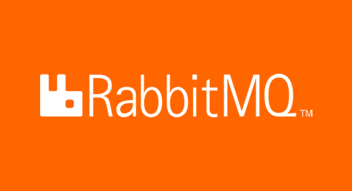

# [Spring] Rabbitmq 연동하기 및 예제

## 1. Rabbitmq란 무엇인가?

RabbitMQ는 AMQP를 기반으로하는 Message Broker입니다.   
그럼 AMQP는 무엇일까요? Advanced Message Queuing Protocol의 약자입니다.  
이름에서 알수 있지만 AMQP 자체가 메세지 큐를 기반으로 하는 프로토콜을 의미 합니다.   
메세지 큐 방식은 통신할때 데이터를 직접적으로 전달하지 않습니다.  
대신에 큐에 데이터를 송신하고, 수신하는 쪽에서는 큐에 있는 데이터를 가져오는 방식입니다.  

Producer 쪽에서는 메세지 큐에 전송하고자 하는 데이터를 전송합니다.   
그럼 메시지 큐에는 데이터가 쌓이게되고, 구독중인 Consumer는 메세지 큐로부터 데이터를 가져옵니다.   
얼핏 보면 Rest api 통신에 메시지 큐만 있는것으로 보일수도 있지만, 메시지 큐를 이용하면 event-driven 방식으로 처리가 가능합니다.   
데이터를 전송받을 떄까지 기다릴 필요없이 데이터가 전달된 순간 정해진 동작을 수행하면 됩니다.   
이러한 이유 떄문에 대용량 트래픽 처리를 필요로 하는 서비스에서 자주 사용합니다.   

그럼 좀더 자세한 동작과 내부 구성요소를 살펴 보도록 할까요?  
큐에 데이터를 적재한다고 하였지만 실제 내부에는 Queue말고도 Exchange라는 것도 존재합니다.   
데이터를 RabbitMQ에 데이터를 전송하면 이 Exchange라는 메시지 핸들러가 가장 먼저 데이터를 수신합니다.   
Exchange는 바로 큐에 넣지않고 미리 설정된 타입에 따라 큐에 데이터를 넣습니다.   
Queue는 말안해도 아시겠지만 선입선출의 자료구조 입니다.  

위의 그림에는 Exchange 하나와 Queue가 하나이지만, 실제로는 하나의 Exchange에 여러개의 Queue를 사용하기도 합니다.   
그럼 Exchange 하나에 Queue가 여러개일때는 어떻게 처리를 할까요?   
앞서 말한 타입에 따라 작동하게 되며, RabbitMQ에서는 4가지 라우팅 타입을 지원하고 있습니다.   

|타입|동작|
|---|---|
|Direct|라우팅 키가 일치하는 큐에 메시지 전달|
|Fanout|Exchange에 bind되어있는 모든 큐에 메시지 전달|
|Headers|key, value로 이뤄진 header에 일치하는 큐에 메시지 전달|
|Topic|라우팅 키 패턴이 일치하는 Queue에 메시지 전달 (*, #등 사용가능)|

그럼 타입 설정을 통해 어떤방식으로 큐에 데이터를 전달하는지에 대한 설정이 완료 되었습니다.   
그럼 이게 끝일까요? 아닙니다. Exchange와 Queue를 연결해주어야 합니다.   
Queue가 Exchange로 부터 메시지를 받아오도록 말이죠. 이 설정이 바로 Binding 입니다.   

Driect 타입

Direct 타입은 Route key가 일치하는 큐에만 데이터를 전달합니다.   
라우팅 키의 경우는 Binding 시에 설정할 수 있습니다.   
주로 어떤 경우에 사용할까요? 이해 하기 쉽게 얘를 들어 보겠습니다.   

사용자가 자신의 닉네임을 변경하였다고 생각해 봅시다.  
정보가 변경되는 경우는 자주 일어나는 경우가 아니고 특정 서비스만 변경에 작업을 해야한다고 생각해봅시다.   
큐에는 다양한 서비스들에서 사용하는 큐만 있고, 특정 서비스들의 큐에만 전달해야 합니다.  
이떄 전달하고자 하는 서비스의 라우팅 키와 데이터를 전달하면 라우팅 키에 해당하는 큐에만 메시지가 전달되게 됩니다.  

라우팅 큐가 완벽히 딱 맞는 큐에만 전달하는 방식이 Direct 타입입니다.   

Fanout 타입

Fanout 타입은 Exchange에 Binding 되어있는 모든 큐에 데이터를 전달합니다.  
라우팅 키와 상관 없이 말입니다. 쉽게 말해 Broad-cast의 방식으로 라우팅 합니다.   
주로 어떤 경우에 사용을 할까요? 이해하기 쉽게 예를 들어 보겠습니다.   

신규 사용자가 회원 가입을 완료 하였고 사용자의 데이터가 메시지 큐에 전달 상태라고 생각해봅시다.   
현재 서비스는 신규 유저에게 다양한 웰컴팩 쿠폰을 제공하고 있습니다.   
그리고 신규 유저에게 가이드 푸시 알림을 전달하고 있습니다.   
이경우 가입 이후의 발생하는 이벤트는 모두 동일 데이터(신규 사용자의 정보)로 부터 발생되는 이벤트 입니다.  

이때 푸시 서비스와 쿠폰 서비스등 모든 서비스에 모두 같은 데이터가 전달되어야 합니다.   
exchange에 binding되어있는 모든 queue로 데이터를 전달해야되므로 fanout 방식을 사용합니다.   

### 1.1 Rabbitmq 설치하고 살펴보기

### 1.2. Rabbitmq 사용 이유

## 2. Rabbitmq 연동하기 및 예제

### 2.1. Rabbitmq 예제 설명

### 2.2. Rabbitmq 실습

### 2.3. Rabbitmq 테스트
