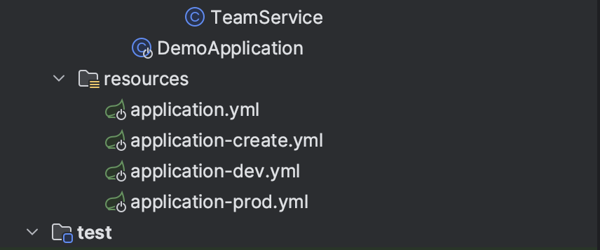
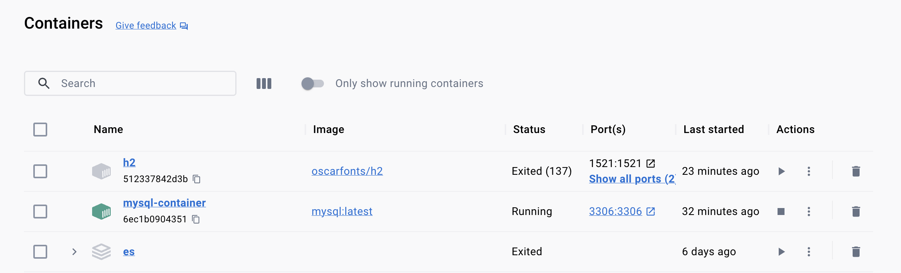

# Spring profile별 환경 분리 하기



## 1. 환경을 분리해야 하는 이유?

현업에서 개발할때 실제 운영 환경에 테스트를 할수는 없습니다.  
테스트간 별다른 큰 문제가 발생하지 않으면 좋겠지만, 그렇지 않을 확률이 높으니까요.  
그래서 테스트시에는 별도로 분리된 환경에서 테스트하는것이 좋습니다.  
예를들면 테스트간 사용하는 DB는 개발용도로만 사용하는 DB이면 좋을것입니다.  

실제 운영환경에서 사용하는 DB는 mysql이고, 테스트시에는 로컬 환경의 h2를 써야하는 경우  
우리는 서로 다른 환경을 구분하기 위한 코드를 짜거나, 다른 설정을 해야 할것입니다.  
다행히 스프링에서는 profile를 통해 서로 다른 설정을 사용하도록 하는 기능을 제공하고 있습니다.  
그럼 어떻게 환경을 구분 할 수 있는지 알아보겠습니다.  

## 2. application.yml를 통한 profile 환경 분리

우리가 보통 사용하는 application.yml 파일 입니다.  

```yml
server:
  port: 8080

spring:
  datasource:
    driver-class-name: org.h2.Driver
    url: jdbc:h2:tcp://localhost:1521/test
    username: sa
    password:

  jpa:
    hibernate:
      ddl-auto: create
    properties:
      hibernate:
        show_sql: true
        format_sql: true
    open-in-view: true

logging:
  level:
    org.hibernate.type.descriptor.sql: trace
```

그럼 어떻게 application.yml 파일을 통해 환경을 분리 할 수 있을까요?  
다행히 스프링에서는 이런한 기능을 옵션을 통해 제공하고 있습니다.  

```yml
spring:
  profiles:
    active: create
```

위의 설정은 profile을 create라는 이름으로 사용하겠다는 뜻입니다.  

```yml
spring:
  profiles:
    default: dev
```

위의 설정은 만일 해당 설정에 해당되는 값이 없을때, 기본 프로필로 무엇을 사용할것인가를 설정합니다.  

## 3. application.yml 를 프로파일 별로 사용해보기

profile별 application.yml 파일을 누나기에 앞서 프로필을 어떻게 나눌것인지 짚어보겠습니다.  
h2는 개발 환경 또는 테스트 환경에서 주로 사용하는 DB입니다.  
MySQL은 실제 운영 환경에서 사용하는 DB로 해보겠습니다.  



또한 테스트 환경과 운영 환경의 다른 점은 다음과 같습니다.  

1. 테스트 환경 - h2, 운영 환경 - MySQL  
2. 테스트 환경에서 테스트를 용이하게 하기 위해 SQL 로그를 확인  
3. 운영 환경에서는 SQL 로그를 남기는 경우 엄청난 로그가 발생할수 있으므로, SQL 로그를 남기지 않음  
4. 테스트 환경에서는 clean한 테스트를 위해서 데이터 베이스는 항상 새로 생성  
5. 환경 별로 포트를 다르게 하여 테스트  