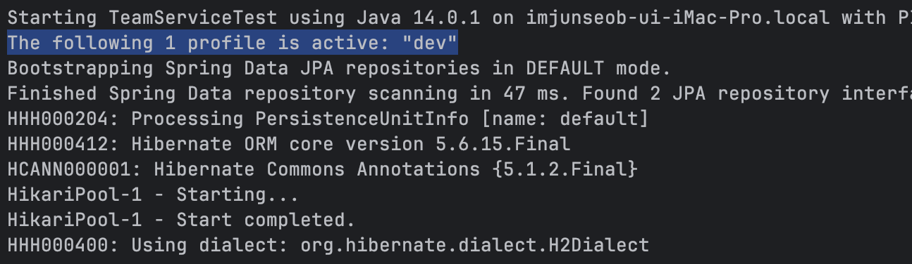

# Spring profile별 환경 분리 하기


## 1. 환경을 분리해야 하는 이유?

실무에서 개발할때는 운영 환경에 테스트를 할수는 없습니다.  
테스트시에 혹여나 데이터를 잘못 건드리는 경우는 장애를 초래 할수 있기 때문인데요.  
테스트간 별다른 큰 문제가 발생하지 않으면 좋겠지만, 그렇지 않을 확률이 높으니까요.  

그래서 테스트시에는 별도로 분리된 환경에서 테스트하는것이 좋습니다.  
혹여나 잘못되더라도 운영 환경에는 아무런 영향이 없기 위함입니다.  
예를들면 테스트간 사용하는 DB는 개발용도로만 사용하는 DB이면 좋을것입니다.  

## 2. 어떻게 분리된 환경을 사용할까?

스프링에서는 설정된 프로필에 따라 다른 환경에서 구동될수 있도록 하는 기능을 제공하고 있답니다.  
예를 들어 개발환경에서 테스트하는 경우 로컬 DB에 접근 하도록 설정하고,  
운영 환경에서는 DB 서버에 접근하도록 설정하는것도 가능합니다.  
만일 프로필에 따른 환경 분리 기능을 제공하지 않는 다면 어떻게 해야 할까요?  
우리는 서로 다른 환경을 구분하기 위한 추가적인 코드를 짜야 할수도 있습니다.   


운영환경에서는 MySQL을 사용하고, 개발 환경에서는 로컬 h2를 써야한다고 가정해보겠습니다.    
각각의 데이터 베이스는 도커를 통해 실행 시키도록 합니다.   
시작/종료를 쉽게 하기 위한것일뿐 꼭 도커 환경에서 학습을 해야하는것은 아닙니다!   
앞선 도커에서 MySQL 포스팅을 통해 데이터 베이스 설치가 완료 상태에서 진행합니다.  
그럼 어떻게 환경을 구분 할 수 있는지 알아보겠습니다.   

## 3. application.yml를 통한 profile 환경 분리

### 3.1. 일반적인 application.yml 파일

application.yml 파일을 한번 봐보도록 하겠습니다.  
h2를 사용하고 있고, 8080 포트를 사용하는 기본적인 application.yml 파일 입니다.  

```yml
server:
  port: 8080

spring:
  datasource:
    driver-class-name: org.h2.Driver
    url: jdbc:h2:tcp://localhost:1521/test
    username: sa
    password:

  jpa:
    hibernate:
      ddl-auto: create
    properties:
      hibernate:
        show_sql: true
        format_sql: true
    open-in-view: true

logging:
  level:
    org.hibernate.type.descriptor.sql: trace
```

### 3.2. application.yml 환경별로 생성하고 설정하기

그럼 어떻게 application.yml 파일을 통해 환경을 분리 할 수 있을까요?   
다행히 스프링에서는 이런한 기능을 옵션을 통해 제공하고 있습니다.   

환경 분리를 위해서는 각자 다른 설정의 파일이 존재해야 겠죠?  
프로필별로 사용할 파일을 만들어 보도록 하겠습니다.  


이렇게 application-<이름>.yml 파일을 만들어 주도록 합니다.  
application.yml은 어떠한 프로필을 사용할것인지 설정하기 위해 사용합니다.  
dev는 개발 환경에서 사용할 설정을 해주는 파일 입니다.   
prod는 운영 환경에서 사용할 설정을 해주는 파일 입니다.   
create는 Jpa 설정에서 ddl-auto 설정이 create로 되어있는 설정입니다.   
예제에서 create는 별도로 설명 하지 않도록 하겠습니다.   

prod 환경은 앞서 설명한 application.yml 의 기본설정에서 다음이 변경되었습니다.  
환경을 분리해야 한다고 하였으니 데이터 베이스를 MySQL로 변경하도록 합니다.   
같은 DB의 다른 데이터 베이스를 사용해도 됩나 쉬운 확인을 위해 서로 다른 DB를 사용하겠습니다.   

```yml
  datasource:
    driver-class-name: com.mysql.cj.jdbc.Driver
    url: jdbc:mysql://localhost:3306/study_db?serverTimezone=Asia/Seoul
    username: root
    password: root1234
```

### 3.3. 환경별 프로필명 설정하기

이제 각각의 프로필로 사용할 파일들에 대한 설정은 완료되었습니다.   
그럼 이제 각각의 프로필을 어떻게 구분할수 있을까요?   
바로 설정 값을 통해 어떠한 프로필로 사용하겠다 라고 스프링에게 알려줄 수 있습니다.  

```yml
spring:
  config:
    activate:
      on-profile: dev

  datasource:
    driver-class-name: org.h2.Driver
```

위의 설정은 이파일을 dev라는 프로필로 사용하겠다고 설정하는 것입니다.  
위 설정을 dev와 prod 파일에 추가해주도록 합니다.   

### 3.4. 사용할 프로필 설정하기

그럼 어떻게 dev와 prod를 사용할지 설정할수 있을까요?  
크게 두가지 방법이 있습니다.   
우선 첫번째 방법은 application.yml 파일에 설정을 추가하는 방법입니다.  

```yml
spring:
  profiles:
    active: prod
```

다음과 같이 말이죠.  
위의 설정은 profile을 prod 라는 이름의 프로필을 사용하겠다는 설정입니다.   

두번째 방법은 인텔리 제이를 통해 설정하는 방법입니다.  
인텔리 제이 상단 메뉴에 Run -> Edit Configurations 설정을 클릭합니다.  


그럼 위와 같은 설정 창이 표시됩니다.  
저희가 만든 스프링 부트 어플리케이션 설정을 클릭합니다.  
Active Profiles에 사용할 프로필의 이름을 입력해줍니다.  
인텔리 제이의 설정을 이용하는 경우 별도의 파일에 설정을 해줄 필요가 없습니다.   

### 3.5. Default 프로필 설정하기

추가로 다음과 같은 설정을 통해 기본 프로필로 무엇을 사용할지도 설정이 가능합니다.   

```yml
spring:
  profiles:
    default: dev
```

위의 설정은 active된 프로필이 없을때, 기본 프로필로 무엇을 사용할것인가를 설정합니다.  
그럼 설정이 제대로 작동하는지 확인 해보도록 하겠습니다.   

## 4. application.yml를 profile 별로 사용해보기

### 4.1. application.yml 파일 나누는 팁!

프로필 설정이 제대로 작동하는지 확인하기 전에 확인 해야할 내용을 보겠습니다.  
application.yml 파일은 분리하여 include 하여 사용하는 기능도 제공하고 있습니다.  
따라서 민감한 정보를 가지고 있는 설정은 따로 분리하여 사용하기도 합니다.   
그럼 프로필 별로 무엇을 나누어야 하고, 무엇을 공통으로 사용할수 있을까요?   

사실 정답은 없습니다. 그래서 개인적으로 사용하는 방법을 공유하려고 합니다.   
저같은 경우에는 개발 환경에서 사용하는 인프라와 관련된 정보는 프로필로 나누어 사용합니다.   
또한 개발 환경에서는 로그를 좀더 쉽게 보기위해 로깅 설정등을 분리합니다.  
그럼 무엇을 공통으로 사용할까요? 예를 들면 Jpa의 설정과 관련된 부분은 공통으로 사용합니다.  
Jpa의 설정의 경우 서로 다르게 설정하는 경우 실제 동작에도 영향을 끼치는 경우가 있기 떄문입니다.   

### 4.2. 프로필 설정 테스트 해보기

그럼 설정이 제대로 동작하는지 확인 해도록 할까요?   
앞서 설정을 제대로 따라오셨다면 지금 환경은 다음과 같습니다.  
dev 프로필은 h2 DB를 prod 프로필은 MySQL의 설정을 가지고 있습니다.  

그럼 테스트 스텝은 다음과 같습니다.  
1. dev 프로필 설정 후 h2 DB에 정상적으로 접속하는지?
2. prod 프로필 설정 후 MySQL DB에 정상적으로 접속하는지?

1번을 테스트하기 위해서 MySQL 컨테이너를 종료하도록 하곘습니다.   
그다음 스프링 어플리케이션을 실행 합니다.  
만일 정상적으로 수행 되었다면 올바르게 설정이 된것입니다.   

그럼 이제 h2 DB도 종료해줍니다.  
그후 다시 스프링 어플리케이션을 실행합니다.  
이번에는 당연히 DB에 접근하지 못하니 구동에 실패 할것입니다.   

2번을 테스트 하도록 하겠습니다.  
기본 프로필을 prod로 변경하여줍니다.  
앞선 테스트를 위해 MySQL을 종료 하였기 떄문에, 역시 구동에 실패 해야합니다.  

실패 하였다면, MySQL을 구동하고 스프링 어플리케이션을 다시 실행합니다.  
prod 프로필은 MySQL에 접근 하므로, 정상 구동되어야 합니다.   

테스트를 마무리하느라 고생하셨습니다!! 그럼 좀더 쉽운 프로필 확인 법을 알려드리겠습니다...?!?!   

### 4.3. 로그를 통해 프로필 확인 하기

프로필 설정을 컨테이너 종료까지 하면서 테스트하였는데, 더 쉬운 방법이 있었다니?  
라고 생각하실수도 있겠습니다.   
네! 말그대로 스프링 어플리케이션 구동시에 로그를 통해 프로필을 확인 하실수 있습니다.   
다음과 같이 말이죠!   



그럼 왜 DB 까지 종료해가면서 확인을 한것일까요?   
물론 로그를 통해서 손쉽게 확인 할수는 있지만, 보다 확실한 확인을 위해 컨테이너를 종료하여 테스트 하였습니다.   
그럼 아까 말씀드린 Default 프로필인 경우에도 로그로 확인 가능할까요?  


네! 가능합니다. 스프링에서 친절하게 활성화된 프로필이 없어 기본값으로 사용하는 프로필 까지 알려줍니다.  
다음에는 설정 파일과 관련된 심화된 내용을 확인해보도록 하겠습니다!   

## 5. 설정 파일 더보기

## 6. 마무리