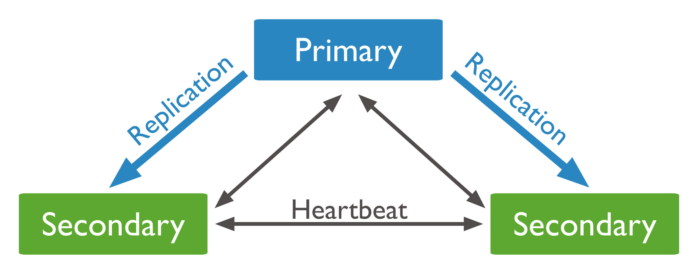
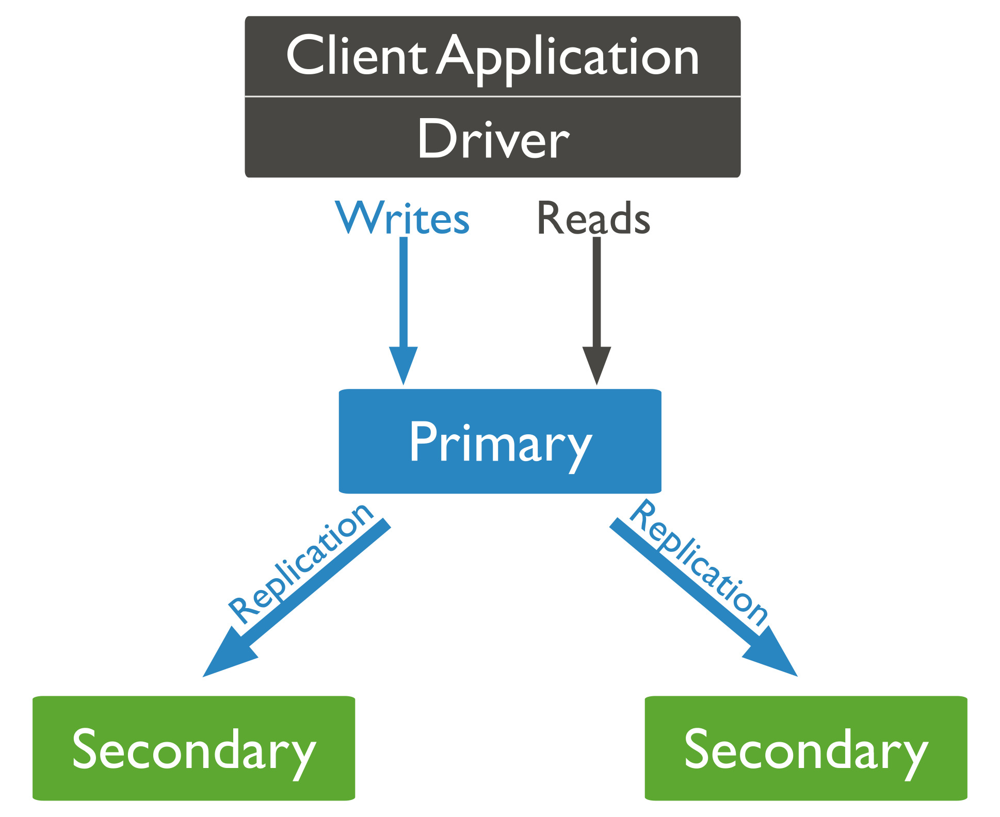
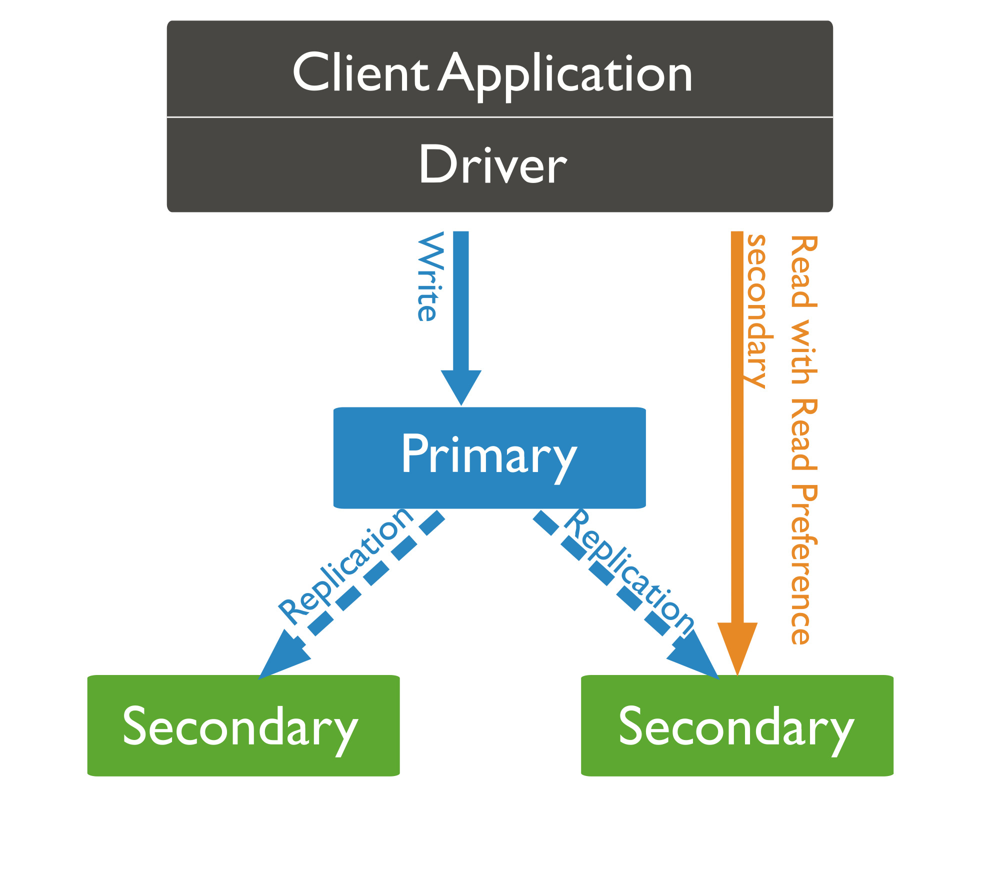

# 분산 DB를 사용하면서 겪은 경험

분산 DB인 Mongodb를 사용하면서 발생한 문제들과 문제를 해결함연서 겪은 경험을 공유하고자 글을 작성하였습니다 :b

## 1. 분산 DB 사용 하면서 겪은 문제

운영 환경은 AWS의 Document DB를 사용하고 있었습니다.  
Document DB는 MongoDB와 호환되는 NoSQL DB 이지만 차이점이 조금 있습니다.  
바로 샤딩은 지원하지 않습니다. 하지만 Replica Set(복제셋)은 지원합니다.  

Replica Set 구성에서 primary 노드의 데이터는 secondary 노드에 동기화 됩니다.  
따라서 primary 노드에 장애가 발생하더라도 데이터는 모든 노드에 동기화 되기 때문에    
secondary 노드가 primary로 승격되어 정상적으로 서비스 운영이 가능합니다.  

서비스 운영중 가끔 이상한 이슈가 발생한적이 있었습니다.  
낮은 확률로 Read 작업에 실패하는 이슈 였습니다.  
특히 해당되는 요청은 없는 데이터를 조회하는 경우가 있을 수 없는 상황이었습니다.   

## 2. 원인 분석과 개선 시도

문제를 해결하기 위해서는 Read의 실패의 원인이 무엇인지를 확인해야 했습니다.  

1. 오류 로그 확인
모든 버그 트래킹의 시작은 로그 확인이므로 오류 발생 로그를 확인 했습니다.  
로그 확인시 Read 요청 자체가 실패하는것이 아닌 DB에 Document가 없는 오류 였습니다.  
2. 데이터 존재 확인
Inset에 실패 한 데이터를 조회하는 것은 아닐까 하는 마음에 DB에 데이터를 조회하였습니다.  
정상적으로 조회가 되는것을 확인헀습니다. 테스트 코드로 조회시에도 조회가 되었습니다.  
3. 특정 데이터 문제 발생하는지 확인
특정 데이터만 해당되는 경우일 수 있어 운영 DB의 데이터를 덤프 떠서 개발 환경으로 옮겼습니다.   
개발 환경에서 테스트 했지만 역시 재현이 안되었습니다.   
4. Document DB 자체의 문제인지 확인
Document DB의 버그일 수도 있다고 생각하였습니다.  
develop이 아닌 staging 환경에서 테스트 하였는데 동일 증상이 나타남을 발견하였습니다.  

하지만 위의 시도에도 불구 하고 뚜렷한 원인이 발견되지 않았습니다.  

## 3. 해결의 실마리

뚜렷한 원인이 발견되지는 않았지만 조금 의심되는 사항은 있었습니다.   
로컬 개발환경에서는 Document DB가 아닌 MongoDB를 사용하여 개발 및 테스트를 진행 합니다.  
하지만 로컬 개발 환경에서는 반복된 테스트에도 동일 증상이 나타나지 않았습니다.   
즉 Mongodb가 아닌 Document DB에서 발생했던 이슈였습니다.  

조회시에 발생하는 이슈이므로 product 환경의 DB에 붙어 테스트 후 비로소 확신이 들었습니다.  
이 이슈는 Document DB를 사용시에만 발생한다 라는것을 말입니다.  
비즈니스 로직 내에서의 버그가 아니라고 생각하였고 더 큰 범위에서 확인을 해야했습니다.  

그래서 실패가 발생하는 전후 상황을 먼저 확인하였습니다.  
그러다가 단순 read가 아닌 insert 이후 read 하는 경우에만 발생한 다는것을 알 수 있었습니다.  
insert가 실패하지는 않았으나 read 안될 수 있는 경우의 수를 따져 보았습니다.
그러다가 정말 중요한 사실을 깨닫게 되었습니다.   

## 3. 문제 해결 과정 (ReadPreference과 WriteConern)

현재 환경이 분산 환경이라는 것을 다시 생각해보았습니다.  
노드간에 데이터 동기화가 제대로 이뤄지지 않는 경우가 있을 수 있지 않나? 라는 생각을 했습니다.   
그래서 DB의 구성에 관련된 설정과 내용을 확인하기 시작했습니다.  

DB의 리소스 사용량 부터 여러가지를 따져 보았을때 동기화가 제대로 이뤄지지는 않았을것으로 보였습니다.  
DB 자체의 이슈보다는 사용하는쪽에서 잘못된 설정 값으로 인해 실패했을 것으로 보였습니다.  
그러던중 두가지 설정에 대해 알게되었습니다. 바로 ReadPreference 설정과 WriteConcern 설정 입니다.  

위의 그림과 같이 아무런 설정을 하지 않는다면 read, write 연산은 primary 노드에서 수행합니다.   
read 작업은 별다른 작업이 추가적으로 필요하지 않습니다. 하지만 wrtie 작업은 조금 다릅니다.  
write 작업이 수행되는 경우 primary 노드에 write된 데이터는 secondary 노드에도 반영되어야 합니다.  
WriteConcern 설정은 secondary 노드 동기화가 얼마나되었는가를 기준으로 write작업을 완료할지에 대한 설정 입니다.  

|설정 값|동작 수행|비고|
|:---|:---|:---:|
|majority|과반수 이상의 노드에 쓰기가 완료된 경우를 쓰기 완료|-|
|N (숫자)|설정된 숫자 만큼 쓰기가 완료된 경우를 쓰기 완료|-|

majority로 설정한다고 해도 primary에서만 read, write가 수행된다면 read에 실패하는 문제가 발생하지 않았을 겁니다.    
wrtie작업 완료후 read시점에 secondary에 데이터가 동기화 되지 않았다고 할지라도 primary에는 데이터가 있기 때문입니다.  
MongoDB는 ACID 특성 보다는 BASE 특성에 강점을 가지는 DB입니다.  
따라서 시간이 지나면 언젠가는 데이터의 정합성은 맞춰가게 되었있을 것 입니다.  

하지만 아직 고려해볼 만한 사항이 남아있습니다.  
primary에서 secondary로 데이터 동기화가 완료되기 전에 primary가 불능 상태가 되면 문제가 발생할것 입니다.  
primary가 교체되었는데 만일 primary 선출된 node가 이전의 데이터가 동기화 되지 못한(과반수가 아닌) 경우가 있습니다.  

write작업의 데이터가 모든 노드에 동기화가 이뤄지지 않았던 데이터는 문제가 발생하게 됩니다.   
따라서 Replica Set 구성에서 write concern 설정을 노드의 갯수만큼 설정을 해야 합니다.  
다만, ACID 특성보다는 BASE 특성이 더 중요하다면 과반수로 설정하는것을 고려 해보아야 합니다.  

위에서는 writeConern 설정이 가지는 작동 방식에 대해 설명하였고 문제가 발생하는 상황에 대해서 설명드렸습니다.  
하지만 당시 상황은 노드가 다운되었거나 하는 상황은 아니었기 떄문에 이경우게 해당되지는 않았습니다.  
하지만 writeConcern설정으로 인해 모든 노드에 동일한 데이터가 존재하지 않는 순간은 존재하였습니다.   
그중 제가 했던 말을 기억하시나요? 모든 작업이 primary에서만 수행되면 문제가 발생하지 않았을거라고...  

당시 환경은 writeConern이 majority로 설정 되어 있었습니다.  
즉, 노드간의 데이터에 차이가 존재하는 순간이 존재하게 됩니다.   
그럼... 이때 만일 primary가 아닌 동기화가 이뤄지지 않은 secondary에 read작업을 하면 어떻게 될까요?  
이슈 상황과 동일한 문제가 발생하게 됩니다.   
readPreference 설저으로 인해 primary에서 모든 작업이 이뤄지지 않았기 때문입니다.  
그래서 read 요청 단독 실행시에는 발생하지 않았고, insert이후 read시에 발생하였던 것입니다.  

앞서 말씀드린것처럼 readPreference 설정은 read 작업을 어떤 노드에서 수행할지에 대하 설정하는 설정 값 입니다.  
당시 환경은 당연히 primary가 아닌 secondary로 되어있었습니다.   
단순히 primary, secondary뿐만 아니라 다양한 옵션이 존재합니다.   

|설정 값|동작 수행|비고|
|:---|:---|:---:|
|Primary|primary 노드에서만 read 작업 수행|기본 값|
|primaryPreferred|primary 노드에서 read 작업 수행하되, 작업이 불가능한 경우 secondary 노드에서 수행||
|secondary|secondary 노드에서만 read 작업 수행||
|secondaryPreferred|secondary 노드에서 read 작업 수행하되, 작업이 불가능한 경우 primary 노드에서 수행||
|nearest|네트워크 응답속도가 가장 빠른 노드에서 read 작업 수행||

결론적으로 두개의 옵션값이 각각의 동작을 하면서 발생하게된 것이 원인이었습니다.   
원인 분석에 시간이 좀 걸린 이유도 다음과 같이 두개의 옵션이 얽힌 상황이었기 떄문입니다.  
동일 설정값을 가지고 테스트시에 동일 증상을 쉽게 확인 할 수 있었습니다.  
이전에 테스트시에는 발견이 어려웠던것은 테스트 환경에서는 옵션 값을 변경하여 사용하였기 때문이었습니다.  
로컬 환경과 실환경의 writeConcern 설정의 차이 그리고 product 코드와 테스트 코드의 차이로 인해...

둘중 한개의 옵션이라도 다르게 설정되어 있었다면 문제가 발생하지 않았을 수도 있습니다.  
만일 writeConcern이 majority가 아니고 노드 갯수로 설정되었었거나  
readPreference 설정값이 primary로 되어있었다면 말이죠.  
secondaryPreferred로 설정 되어있던 이유는 단순히 부하를 분산하려는 의도 였다고 합니다.

위 문제는 문제 해결에 시간이 좀 오래 걸린 문제임과 동시에 저를 많이 괴롭혔던 문제이기도 합니다.  
하지만 이로 인해 분산 DB에 대해 조금 더 많이 생각해 보는 계기가 되었습니다.  
이 문제로 인해 파생된 문제들이 한두개가 아니었는데 이 문제가 해결되면서 다같이 해결되었습니다.  
비즈니스 로직의 문제가 아닌 설정값의 문제로 인해 readPreference 옵션 값 수정 이후엔 발생하지 않았습니다.  
동일 설정값을 가지고 테스트시에 동일 증상을 쉽게 확인 할 수 있었습니다.  

## 4. 마무리

여기까지 좌충우돌 분산 DB 사용기를 보셨습니다.   
MongoDB 뿐만 아니라 Document DB 에도 해당되는 내용입니다.   
다만 포스팅 작성 날짜를 기준으로 Document DB는 샤딩 구성을 지원하고 있지 않습니다.   

이상 포스팅을 마칩니다!  
읽어주셔서 감사합니다! 다음 포스팅에서 또 뵙겠습니다!  